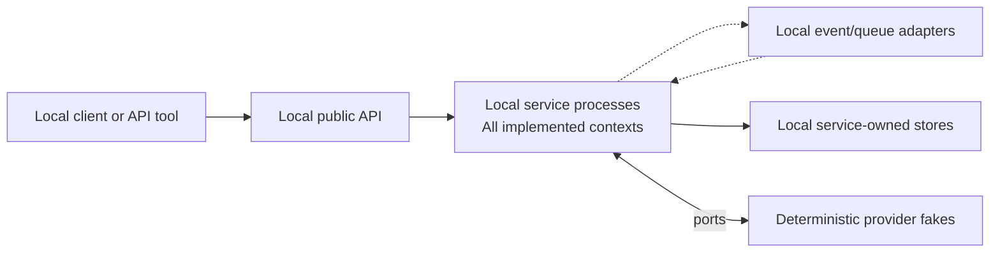
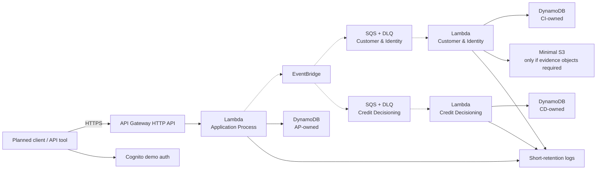

# Container Architecture

## 1. Purpose and authority

This document defines the C4 container architecture for the Loan Onboarding Platform and overlays it with the Local Zero AWS Cost and AWS Demo execution profiles. It assigns runtime responsibilities and data ownership without replacing the [bounded context map](../domain/BOUNDED_CONTEXTS_AND_EVENT_STORMING.md), [business rules](../domain/BUSINESS_RULES.md), [event catalog](../domain/DOMAIN_EVENTS.md), or specialized [Credit Decisioning design](../domain/CREDIT_DECISIONING_DESIGN.md).

**Lifecycle status:** `Proposed` architecture baseline for issue #2. All containers are planned; no deployable implementation exists. Confirmed domain boundaries and solution directions are labelled separately from implementation status.

## 2. Architectural rules

1. Application Process is the saga coordinator. It observes capability outcomes and advances the journey; it does not make identity, credit, document, signature, communication, booking, or disbursement decisions.
2. Each business service owns its domain model and data. There is no shared database, shared domain model, or cross-database query.
3. The public API is synchronous. Cross-context propagation is asynchronous through versioned integration events unless a future ADR explicitly establishes another contract.
4. Amazon EventBridge routes published events. Every deployed consumer receives events through its own Amazon SQS queue and DLQ so retry, back-pressure, and quarantine are independent.
5. The Audit Projection is asynchronous and non-authoritative. It cannot become a source for business decisions.
6. Business/application code depends on ports. AWS SDKs and provider clients are confined to infrastructure adapters.
7. Domain events remain internal to their owner. Only catalogued integration events cross a context boundary.
8. Technical failures remain operational dispositions or recovery paths, never credit outcomes.

## 3. Logical container diagram

```mermaid
flowchart TB
    client["Planned Client / UI\nQ-001 · Proposed"]
    cognito["Amazon Cognito\nDemo authentication · Planned"]
    api["Public Synchronous API\nCommands and queries · Planned"]

    subgraph business["Authoritative business containers"]
        ap["Application Process\nSaga coordinator"]
        ci["Customer & Identity\nCustomer and verification evidence"]
        cd["Credit Decisioning\nAssessment, decision, alternatives, Credit Offer"]
        dp["Document Preparation\nVersioned document packages"]
        es["Electronic Signature\nSignature envelopes"]
        co["Communications\nNotifications and OTP"]
        lb["Loan Booking\nLoan reservations and accounts"]
        ds["Disbursement\nDisbursement orders"]
    end

    subgraph async["Asynchronous platform containers"]
        bus["EventBridge\nIntegration-event routing"]
        queues["Per-consumer SQS + DLQ\nIndependent delivery and recovery"]
        audit["Audit & Compliance Projection\nNon-authoritative read model"]
    end

    subgraph data["Service-owned persistence boundary"]
        stores["One logical store per service\nDynamoDB default in AWS"]
        objects["Protected object storage\nDocuments/evidence by reference"]
    end

    subgraph providers["Replaceable provider adapters"]
        idp["Identity Provider"]
        sigp["Signature Provider"]
        notifp["Notification Provider"]
        disp["Disbursement Provider"]
    end

    client -->|"authenticate"| cognito
    client -->|"HTTPS sync"| api
    api -->|"validated sync command/query"| ap
    api -->|"authorized capability query"| ci
    api -->|"authorized capability query"| cd

    ap -.->|"integration events"| bus
    ci -.->|"integration events"| bus
    cd -.->|"integration events"| bus
    dp -.->|"integration events"| bus
    es -.->|"integration events"| bus
    co -.->|"integration events"| bus
    lb -.->|"integration events"| bus
    ds -.->|"integration events"| bus
    bus -.-> queues
    queues -.-> ap
    queues -.-> ci
    queues -.-> cd
    queues -.-> dp
    queues -.-> es
    queues -.-> co
    queues -.-> lb
    queues -.-> ds
    queues -.-> audit

    ap --> stores
    ci --> stores
    cd --> stores
    dp --> stores
    es --> stores
    co --> stores
    lb --> stores
    ds --> stores
    audit --> stores
    ci --> objects
    dp --> objects
    es --> objects

    ci <-->|"provider-neutral port"| idp
    es <-->|"provider-neutral port"| sigp
    co -->|"provider-neutral port"| notifp
    ds <-->|"provider-neutral port"| disp

    classDef business fill:#dff0d8,stroke:#3c763d,color:#222;
    classDef platform fill:#d9edf7,stroke:#31708f,color:#222;
    classDef external fill:#f2dede,stroke:#a94442,color:#222;
    classDef data fill:#fcf8e3,stroke:#8a6d3b,color:#222;
    class ap,ci,cd,dp,es,co,lb,ds business;
    class client,api,bus,queues,audit,cognito platform;
    class idp,sigp,notifp,disp external;
    class stores,objects data;
```

**Legend:** solid arrows are synchronous calls or direct adapter access; dashed arrows are asynchronous integration-event delivery. Green containers own business behavior and authoritative data. Blue containers provide edge or platform capabilities. Yellow containers represent service-owned persistence, never a shared schema. Red containers are external providers behind adapters. The diagram shows logical relationships, not network placement.

The `stores` shape is visual shorthand: every service and projection has an independently owned store or schema and credentials. It is not one shared database.

## 4. Container catalog

| Container | Responsibility | Owning bounded context | Inbound / outbound | Owned data | Dependencies | Execution profile | Lifecycle status |
|---|---|---|---|---|---|---|---|
| Planned Client / UI | Guide actors through commands and queries without holding business authority. Shape remains `Q-001`. | None | In: human interaction. Out: authentication and HTTPS API calls. | Ephemeral presentation state only. | Cognito, Public API. | Local and AWS Demo. | Proposed |
| Public Synchronous API | Authenticate/authorize, validate transport input, route commands and queries, and return transport responses. | None; platform edge | In: HTTPS. Out: application ports. | No business data. | Cognito and deployed services. | Local adapter; API Gateway HTTP API in AWS Demo. | Proposed |
| Application Process | Coordinate the saga, coarse process state, correlation, and recovery without deciding capability outcomes. | Application Process | In: public commands and integration events. Out: integration events and capability requests through ports. | Application and onboarding-process state, idempotency records. | Event transport, owned store. | Local; initial AWS walking skeleton. | Confirmed boundary; Planned implementation |
| Customer & Identity | Own customer identity, verification evidence, and provider-neutral verification outcomes. | Customer & Identity | In: commands/events. Out: integration events and identity-provider calls. | Customer, identity-check and evidence metadata. | Identity adapter, protected objects, event transport, owned store. | Local; initial AWS walking skeleton. | Confirmed boundary; Planned implementation |
| Credit Decisioning | Own assessments, decisions, alternatives, immutable Credit Offer, rule trace, and operational disposition. | Credit Decisioning | In: assessment/retry/reassessment requests and facts. Out: decision/offer integration events. | CreditAssessment, CreditOffer, policy version and rule trace. | Event transport, owned store, versioned policy. | Local; initial AWS walking skeleton. | Confirmed boundary; Planned implementation |
| Document Preparation | Generate, version, invalidate, and expose protected document packages. | Document Preparation | In/out: integration events; protected object access. | DocumentPackage metadata and version references. | Protected objects, event transport, owned store. | Local; later AWS increment. | Confirmed boundary; Planned implementation |
| Electronic Signature | Manage provider-neutral signature envelopes and signature outcomes. | Electronic Signature | In/out: integration events and provider calls. | SignatureEnvelope state and provider references. | Signature adapter, protected objects, event transport, owned store. | Local; later AWS increment. | Confirmed boundary; Planned implementation |
| Communications | Own notifications and OTP challenge lifecycle; delivery failure does not imply business failure. | Communications | In: integration events/OTP commands. Out: provider delivery and integration events. | Notification attempts, OtpChallenge and delivery references. | Notification adapter, event transport, owned store. | Local; later AWS increment. | Confirmed boundary; Planned implementation |
| Loan Booking | Reserve the loan as `PendingDisbursement` and activate it only after confirmed disbursement. | Loan Booking | In/out: integration events. | LoanAccount and reservation state. | Event transport, owned store. | Local; later AWS increment. | Confirmed boundary; Planned implementation |
| Disbursement | Execute an idempotent disbursement order and classify outcomes for retry, reconciliation, or terminal handling. | Disbursement | In/out: integration events and provider calls. | DisbursementOrder, attempts, reconciliation state. | Disbursement adapter, event transport, owned store. | Local; later AWS increment. | Confirmed boundary; Planned implementation |
| Integration Event Router | Route versioned integration events without business interpretation. | None; platform | In: published events. Out: consumer queues. | Routing configuration, not business state. | Producers and SQS queues. | Local broker adapter; EventBridge in AWS Demo. | Confirmed direction; Planned implementation |
| Consumer Queue and DLQ | Isolate each deployed consumer's delivery, retries, back-pressure, and quarantine. | None; platform | In: routed event. Out: one consumer or its DLQ. | Delivery metadata and quarantined messages. | EventBridge and consumer. | Local queue adapter; SQS+DLQ in AWS Demo. | Confirmed direction; Planned implementation |
| Audit & Compliance Projection | Build an asynchronous, immutable operational/compliance view; never answer authoritative business questions. | Cross-cutting projection | In: integration events. Out: operator queries/exports. | Projection records, immutable snapshots where required, and event references; none are authoritative business state. | Its own queue/DLQ and store. | Local; AWS only when required by demo slice. | Confirmed concept; Planned implementation |
| Service-owned Store | Persist one service's authoritative model or one projection. | Same as owner | In/out: owner only. | Owner-specific records. | Persistence port. | Local development store; DynamoDB default in AWS. | Confirmed direction; Planned implementation |
| Protected Object Store | Hold evidence and document objects referenced by metadata; prevent payload duplication in events. | Object owner remains the business context | In/out: authorized owner adapters. | Encrypted objects with explicit expiry/retention. | Object-storage port. | Local filesystem/test adapter; minimal S3 only if required in AWS Demo. | Proposed |
| Provider Adapters | Translate provider protocols and failures into provider-neutral ports and operational outcomes. | Calling context | In/out: owner and external provider. | No authoritative business state. | Deterministic fake locally; selected demo integration if justified. | Local and AWS Demo. | Confirmed pattern; provider choices Planned/Deferred |

### Accepted-offer progression

Credit Decisioning owns assessments, decisions, alternatives, and the immutable `Credit Offer`, including canonical terms, creation, expiry, and supersession. Under confirmed resolution [`HS-001`](../domain/EVENT_STORMING.md#11-hotspots), Application Process owns the applicant's acceptance or explicit rejection of the active offer, the referenced `offerId`, exact accepted canonical `termsHash`, action timestamp, coarse stage history, and idempotency. Application Process does not mutate or redefine the offer. Consumers learn the action through a versioned integration event or a non-authoritative projection, never by reading Application Process persistence.

The downstream sequence remains `Signed Package` -> `Loan Reservation (PendingDisbursement)` -> `Disbursement` -> `Loan Activation`. An operational failure cannot skip, reorder, or fabricate a successful step.

## 5. Local Zero AWS Cost overlay

- Default developer profile; no AWS account or credentials.
- Future Docker Compose may orchestrate processes, but the logical seams do not depend on Docker.
- Deterministic fakes cover identity, signature, notification, and disbursement behavior, including timeout and failure scenarios.
- Local stores, event adapters, and protected-object adapters are replaceable and remain owner-scoped.
- Ports, domain behavior, integration-event meaning, idempotency, replay, DLQ/recovery semantics, authorization boundaries, and sensitive-data rules remain equivalent to hosted profiles.
- LocalStack is neither required nor assumed.

## 6. AWS Demo overlay

The first AWS deployment is one Region and only the walking skeleton: Application Process, Customer & Identity, Credit Decisioning, plus minimum edge and asynchronous infrastructure. It uses Lambda without Provisioned Concurrency, API Gateway HTTP API, EventBridge, a separate SQS queue and DLQ per deployed consumer, small service-owned DynamoDB tables, optional minimal S3, Cognito only for demo authentication, and short-retention CloudWatch logs.

Guardrails:

- Keep payloads small, Lambda memory/time and reserved-concurrency limits low but functional, log levels conservative, and high-cardinality fields out of metrics.
- Do not enable verbose logging, unnecessary distributed tracing, cross-Region replication, or optional paid data features by default.
- Apply explicit expiry or retention to transient records, objects, queues, DLQs, and logs where supported and consistent with unresolved `Q-003`.
- Deploy for a bounded demonstration window, exercise it, export only required evidence, then destroy resources and verify deletion and billing state.
- Tag supported resources with `project`, `environment`, `owner`, `managedBy`, and `expiresAt`.

The AWS Demo profile prohibits NAT Gateway, EKS, always-running ECS/Fargate, EC2, RDS, MSK, OpenSearch, DAX, Global Tables, multi-Region resources, always-on caches, and Lambda Provisioned Concurrency. Prefer AWS owned/managed encryption keys where they satisfy the demonstration requirement and avoid separately billed key resources.

## 7. Cost model and governance

AWS pricing and Free Tier programs change. The assumptions below were reviewed on **2026-08-12** against the official sources in [Section 8](#8-official-aws-sources). They are planning constraints, not permanent prices, quotas, or a promise of a zero bill.

| Resource | Billing driver | Free-tier or credit dependency | Demo limit | Cost mitigation | Teardown behavior |
|---|---|---|---|---|---|
| API Gateway HTTP API | API calls and data transfer | Current account eligibility, Free Tier/credits, Region and current terms | Walking-skeleton routes and low manual traffic only | HTTP API; no REST-only features; small payloads | Delete API, stages, routes, integrations, and custom logs |
| Lambda | Requests, execution duration, memory and optional features | Current request/duration allowances or credits | Three business services; no Provisioned Concurrency; low timeout/memory | On-demand execution, bounded tests, no always-on workloads | Delete functions, versions, event mappings, and retained logs |
| EventBridge | Published/delivered events and optional features | Current allowances or credits | One demo bus/rules for the deployed slice | Small canonical events; no archive/replay unless explicitly tested | Delete rules, targets, bus, archives and schedules |
| SQS and DLQs | API requests, payload chunks and data transfer | Current allowances or credits | One queue plus DLQ per deployed consumer | Batch where safe, short retention, bounded retries, purge tests | Purge and delete all queues and DLQs |
| DynamoDB | Reads, writes, storage, backups and optional features | Capacity-mode-specific allowances or credits | One small owner-scoped table per deployed service | On-demand for ephemeral unknown traffic; no PITR/backups/Streams unless required; TTL for transient records | Delete tables and verify no retained backups/exports |
| Cognito | Monthly active users and optional features | Tier, feature, account eligibility and credits | Demo users only; no advanced security features by default | Reuse one minimal demo user pool during deployment window | Delete app clients, domain and user pool; remove demo users |
| S3 | Stored bytes, requests, retrieval/data transfer and optional features | Current allowances or credits | One minimal bucket only if evidence objects are required | Small synthetic objects, lifecycle expiry, no versioning unless tested | Empty versions/delete markers, delete bucket, verify no retained objects |
| CloudWatch | Log ingestion/storage, metrics, alarms, dashboards and traces | Current allowances or credits | Essential logs and a minimal alarm set only | Short retention; no verbose logs, unnecessary tracing or high-cardinality custom metrics | Delete log groups, alarms and dashboards after resource deletion |
| Budgets / Cost Anomaly Detection | Budget/action features, monitored spend and notification services under current terms | Feature and notification pricing/eligibility can change | One budget email and one anomaly monitor/subscription | Alert early; keep recipients current; alerts are not spending caps | Remove demo-specific budgets, monitors and subscriptions if not reused |
| Data transfer | Internet and cross-Region bytes | Aggregate allowances, credits and current terms | Same-Region services; tiny synthetic payloads | One Region, no cross-Region resources, no large downloads | Verify no endpoints or retained resources continue transfer |

### Mandatory controls before an AWS deployment

1. Revalidate the account's Free Tier/credit eligibility, current service pricing, chosen Region, quotas, and terms. A pre-existing or ineligible account can incur charges immediately.
2. Produce an AWS Pricing Calculator estimate from explicit traffic, duration, storage, log, and data-transfer assumptions.
3. Configure an AWS Budget email alert and Cost Anomaly Detection monitor/subscription before workload deployment. Alerts notify; they do not cap or stop spend.
4. Record the planned deployment and teardown window and apply the required tags.
5. Run deployment and teardown from repeatable infrastructure automation when that repository is authorized.
6. After destroy, inspect the resource inventory and billing/cost views for residual tables, buckets, queues, logs, backups, network resources, or charges.

Only the local profile guarantees zero AWS cost. The AWS Demo profile minimizes exposure but cannot guarantee zero cost.

## 8. Official AWS sources

Pricing and eligibility must be revalidated before a public deployment guide is approved:

- [AWS Free Tier](https://aws.amazon.com/free/)
- [AWS Lambda pricing](https://aws.amazon.com/lambda/pricing/)
- [Amazon API Gateway pricing](https://aws.amazon.com/api-gateway/pricing/)
- [Amazon EventBridge pricing](https://aws.amazon.com/eventbridge/pricing/)
- [Amazon SQS pricing](https://aws.amazon.com/sqs/pricing/)
- [Amazon DynamoDB pricing](https://aws.amazon.com/dynamodb/pricing/)
- [Amazon Cognito pricing](https://aws.amazon.com/cognito/pricing/)
- [Amazon S3 pricing](https://aws.amazon.com/s3/pricing/)
- [Amazon CloudWatch pricing](https://aws.amazon.com/cloudwatch/pricing/)
- [AWS Cost Anomaly Detection](https://docs.aws.amazon.com/cost-management/latest/userguide/manage-ad.html)
- [AWS Budgets](https://docs.aws.amazon.com/cost-management/latest/userguide/budgets-managing-costs.html)
- [AWS Pricing Calculator](https://calculator.aws/)

## 9. Hosting independence

- Inbound and outbound ports express platform needs; adapters implement local, AWS, or provider protocols.
- Domain and application layers do not reference AWS SDKs, Lambda handlers, EventBridge envelopes, DynamoDB records, or provider DTOs.
- Switching execution profile does not alter domain rules, event semantics, IDs, idempotency requirements, recovery policies, or security boundaries.
- Each service owns its persistence mapping and can replace its infrastructure without exposing storage schemas as contracts.
- Integration contracts are versioned independently of brokers and repositories. No implementation repository is created until its documented readiness criteria are met.

## 10. Navigation

- [System context](SYSTEM_CONTEXT.md)
- [Architecture assumptions and open questions](../discovery/ASSUMPTIONS.md)
- [Bounded context map](../domain/BOUNDED_CONTEXTS_AND_EVENT_STORMING.md)
- [Canonical business rules](../domain/BUSINESS_RULES.md)
- [Canonical event catalog](../domain/DOMAIN_EVENTS.md)
- [Canonical Event Storming model](../domain/EVENT_STORMING.md)
