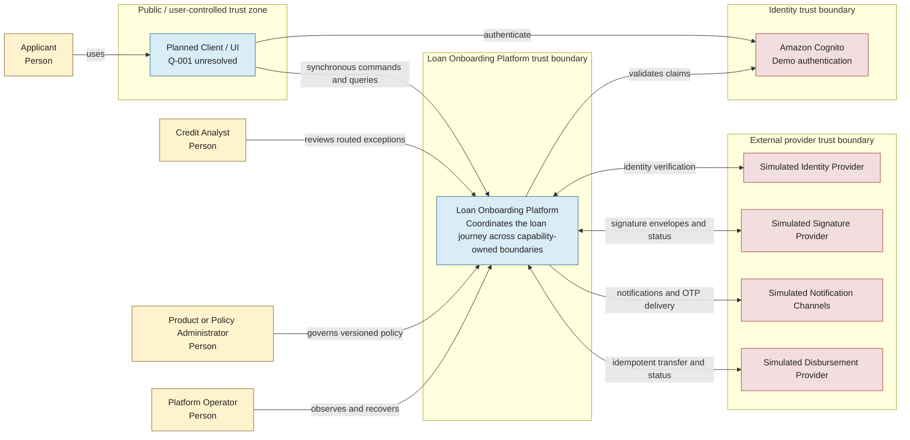

# System Context

## 1. Purpose and authority

This document defines the C4 system context for the Loan Onboarding Platform. It explains who uses the platform, what the platform is responsible for, which systems remain outside its boundary, and where trust changes occur. It does not define domain rules, event payloads, provider selection, or low-level cloud topology.

The [MVP scope](../discovery/SCOPE.md), [ubiquitous language](../domain/UBIQUITOUS_LANGUAGE.md), [bounded context map](../domain/BOUNDED_CONTEXTS_AND_EVENT_STORMING.md), and [canonical Event Storming model](../domain/EVENT_STORMING.md) remain authoritative for their subjects. When this view conflicts with one of those sources, the specialized source wins and this document must be corrected.

**Lifecycle status:** `Proposed` architecture baseline for issue #2. The business boundaries are `Confirmed`; implementation and provider choices remain `Planned` or unresolved as stated below.

## 2. System purpose

The Loan Onboarding Platform demonstrates an event-driven journey for a low-value unsecured personal loan. It coordinates progressive application capture, identity verification, explainable credit assessment, offer presentation, document preparation, electronic signature, loan reservation, disbursement, and activation while keeping each business capability authoritative for its own decisions and data.

The platform is an architecture demonstration, not a production lending system or country-specific regulatory implementation.

## 3. Boundary

### In scope for the platform

- Coordinate the end-to-end application process without taking ownership of capability-specific decisions.
- Capture and validate application information progressively.
- Verify identity through a replaceable provider integration.
- Produce only the canonical credit outcomes `Favorable` and `Unfavorable`; represent incomplete or failed processing with `PendingEvidence`, `PendingRetry`, or `OperationalException`.
- Construct and present eligible alternatives for a favorable assessment.
- Prepare versioned documents, obtain electronic signatures, send communications and OTP challenges, reserve a loan, disburse funds, and activate the loan.
- Publish versioned integration events and build asynchronous operational and audit projections.
- Support deterministic local execution and an optional, ephemeral AWS demonstration profile.

### MVP boundary

The complete MVP journey covers all eight bounded contexts. The first deployable walking skeleton is intentionally smaller: Application Process, Customer & Identity, and Credit Decisioning with the minimum edge and asynchronous infrastructure required to demonstrate their interactions. See the [walking skeleton boundary](../discovery/SCOPE.md#walking-skeleton-boundary).

### Out of scope

- Production underwriting policy, live financial parameters, or regulatory compliance claims.
- Production provider commitments or vendor-specific business behavior.
- Loan servicing after activation, collections, accounting, treasury, fraud operations, or a general-purpose core banking system.
- A finalized client/UI architecture; this remains open question `Q-001` in the [assumptions register](../discovery/ASSUMPTIONS.md#open-questions).
- Low-level AWS account, VPC, IAM, WAF, network, deployment-pipeline, or security topology. Those require later threat modelling and ADRs.
- Implementation repositories or deployable service code before their documented entry criteria are met.

## 4. People and responsibilities

| Actor | Responsibility and interaction | Lifecycle status |
|---|---|---|
| Applicant | Starts and progresses an application, supplies evidence, reviews alternatives, expresses an offer choice, approves documents, completes OTP and signature steps, and receives status communications. | Confirmed |
| Credit Analyst | Investigates explicitly routed exceptional or manual-review cases; does not silently replace deterministic policy evaluation in the MVP. | Proposed |
| Product or Policy Administrator | Governs versioned product and credit-policy configuration through a future controlled administrative capability; direct database editing is not permitted. | Proposed |
| Platform Operator | Observes processing, DLQs, reconciliation, cost controls, and recovery workflows without changing credit outcomes. | Confirmed |

## 5. External systems

| External system | Direction at the platform boundary | Responsibility | Lifecycle status |
|---|---|---|---|
| Amazon Cognito | Applicant/client -> Cognito; platform API validates issued identity claims | Demo authentication only. It is not the Customer & Identity bounded context and does not own customer verification. | Confirmed solution direction; integration Planned |
| Identity Provider | Customer & Identity <-> provider | Performs simulated identity checks through a provider-neutral port. Local deterministic fake is the default; no production vendor is selected. | Simulated provider Confirmed; production provider Deferred |
| Simulated Signature Provider | Electronic Signature <-> provider | Creates and tracks signature envelopes through a replaceable adapter. No production vendor is selected. | Proposed |
| Simulated Notification Channels | Communications -> provider | Capture notifications and OTP messages deterministically. No production delivery channel is selected. | Proposed |
| Simulated Disbursement Provider | Disbursement <-> provider | Accepts idempotent transfer instructions and reports deterministic outcomes. No production vendor is selected. | Proposed |

External provider timeouts, unavailability, and technical errors are operational conditions. They never become `Unfavorable` credit decisions.

## 6. System context diagram

**Legend:** solid arrows show interaction direction. Bidirectional arrows represent a request plus a later response or status lookup, not shared ownership. Boxes group distinct trust zones; crossing a box boundary requires authentication, authorization, validation, minimization, and auditable handling appropriate to that boundary.

## 7. Trust-boundary rules

1. The planned client is untrusted. All commands and identifiers are validated at the public synchronous API boundary.
2. Cognito authenticates demo users; the platform remains responsible for authorization. Customer & Identity remains authoritative for identity-verification evidence and outcomes.
3. Provider adapters validate and translate external data into provider-neutral ports. Provider payloads do not enter domain models directly.
4. Sensitive documents and evidence use protected object storage; integration events contain references and minimum necessary metadata rather than document bodies or unrestricted personal data.
5. Each bounded context owns its model and data. No actor, provider, projection, or neighboring context reads another context's store directly.
6. Operational tooling can retry, reconcile, or quarantine processing, but cannot manufacture business success or alter a credit outcome.

These are architecture constraints, not a complete security design.

## 8. Execution profiles

### Local Zero AWS Cost — default

- Requires no AWS account, credentials, or deployed AWS resources and therefore guarantees zero AWS cost.
- A future Docker Compose environment will run local service processes, replaceable infrastructure adapters, deterministic provider fakes, and local development stores.
- It preserves the same application ports, domain behavior, event semantics, idempotency, recovery, and security boundaries as hosted profiles.
- It does not depend on LocalStack. AWS emulation may not become a prerequisite for local development.

### AWS Demo — optional and ephemeral

- Demonstrates the same logical architecture in one AWS Region using managed, usage-based services.
- Initially deploys only Application Process, Customer & Identity, Credit Decisioning, and the minimum API, event, queue, data, identity, and logging resources required for the walking skeleton.
- Remaining business capabilities stay `Planned` until their own entry criteria are satisfied.
- Must be explicitly deployed for a demonstration and torn down afterward. It is Free-Tier-aware, not guaranteed to be free.

Changing profiles changes adapters and deployment configuration, not domain rules, integration-event meaning, or ownership boundaries.

## 9. Known unresolved decisions

- `Q-001`: the client/UI shape is not selected. This context uses a neutral planned client boundary.
- `Q-002`: AWS Region and account safeguards require a later ADR before deployment instructions are published.
- `Q-003`: final operational and audit retention periods require later decisions; the demo must use short explicit values.
- `HS-001`: offer acceptance and rejection ownership is inconsistent across legacy and current design sources. The platform therefore shows accepted-offer progression without assigning the disputed command or event. See [Event Storming hotspots](../domain/EVENT_STORMING.md#11-hotspots).

## 10. Navigation

- [Container architecture](CONTAINER_DIAGRAM.md)
- [MVP scope](../discovery/SCOPE.md)
- [Architecture assumptions and open questions](../discovery/ASSUMPTIONS.md)
- [Bounded context map](../domain/BOUNDED_CONTEXTS_AND_EVENT_STORMING.md)
- [Canonical events](../domain/DOMAIN_EVENTS.md)
- [Canonical Event Storming model](../domain/EVENT_STORMING.md)
