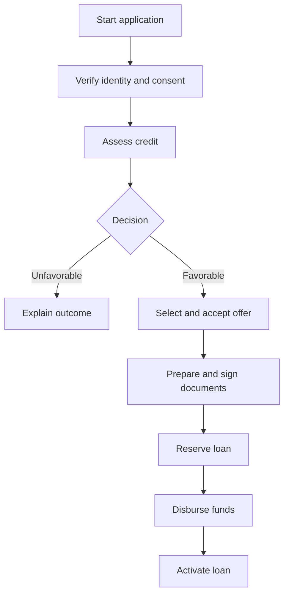

# Product Vision

**Status:** Accepted for MVP

**Last updated:** 2026-08-06

## Vision statement

For people seeking fast access to a low-value personal loan, the Loan Onboarding Platform provides a simple, traceable digital journey from application to activated loan. Unlike a tightly coupled lending backend, it separates business capabilities, makes decisions explainable, and safely recovers distributed operations.

## Problem

Digital lenders must coordinate identity providers, risk signals, affordability rules, documents, signatures, disbursement gateways, and loan booking. When this workflow is concentrated in one backend or coupled to specific providers, it becomes difficult to:

- change credit rules or product parameters safely;
- replace an external provider;
- explain a favorable or unfavorable decision;
- retry failures without creating duplicate financial operations;
- audit consent, decisions, signatures, and money movement;
- know the exact stage of an application.

## Target customer and actors

The MVP models an adult individual applying for a `Quick Personal Loan` through a digital channel. It uses a neutral financial domain rather than country-specific regulation.

| Actor | Goal |
| --- | --- |
| Applicant | Start with little friction, understand the result, and complete the loan digitally. |
| Credit analyst | Inspect exceptional or failed cases without altering automated policy silently. |
| Product or policy administrator | Evolve product parameters and decision rules through governed versions. |
| Platform operator | Trace, recover, and monitor the distributed workflow safely. |
| External provider | Supply identity, risk, signature, communication, or disbursement capabilities through replaceable adapters. |

## Value proposition

### Applicant value

- Minimal information required to start.
- Progressive collection of evidence only when needed.
- Clear offer terms or understandable reason codes.
- Visible process state and a complete digital journey.

### Fintech value

- Explainable and versioned credit decisions.
- Independent business capabilities and provider adapters.
- Idempotent handling of signatures, loan booking, and disbursement.
- End-to-end traceability and recoverability.
- Controlled evolution of APIs, events, and policies.

### Portfolio value

This is Samuel Serrano's flagship architecture and implementation project. It must demonstrate senior-level .NET and AWS consulting skills through explicit discovery, DDD, event-driven design, security, testing, observability, infrastructure as code, and Spec-Driven Development—not merely a working API.

## Product principles

1. **Easy to start, safe to complete.** Low entry friction never removes identity, consent, affordability, or risk controls.
2. **Explain decisions.** Persist the policy version, relevant inputs, evaluated rules, and reason codes.
3. **Model operational uncertainty separately.** Missing evidence or provider failure is not a credit decline.
4. **Protect irreversible operations.** Signature, booking, and disbursement require idempotency and auditable evidence.
5. **Own data by capability.** Services do not read or write another service's database.
6. **Prefer replaceable boundaries.** External providers remain behind ports and anti-corruption layers.
7. **Design for demonstration without pretending production certification.** Use fictitious data, policies, and providers while preserving production-minded patterns.

## Desired outcomes

- A complete local happy path can be run reproducibly.
- A favorable decision produces alternatives and one immutable selected offer.
- An unfavorable decision contains stable, explainable reason codes.
- Replayed messages never produce duplicate disbursements or loan accounts.
- A single correlation ID traces the application across all services.
- Each repository can be evaluated independently while the architecture repository presents the whole system.

## Product journey

## Non-goals of the vision

The project does not claim to operate a regulated lending business, use production scoring, process real money, or provide jurisdiction-specific compliance. Those require legal, regulatory, security, and operational validation outside this portfolio MVP.
