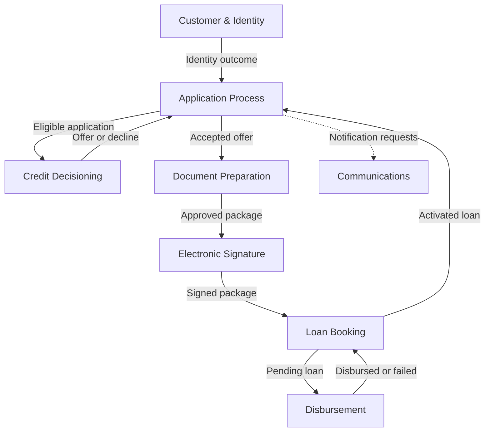
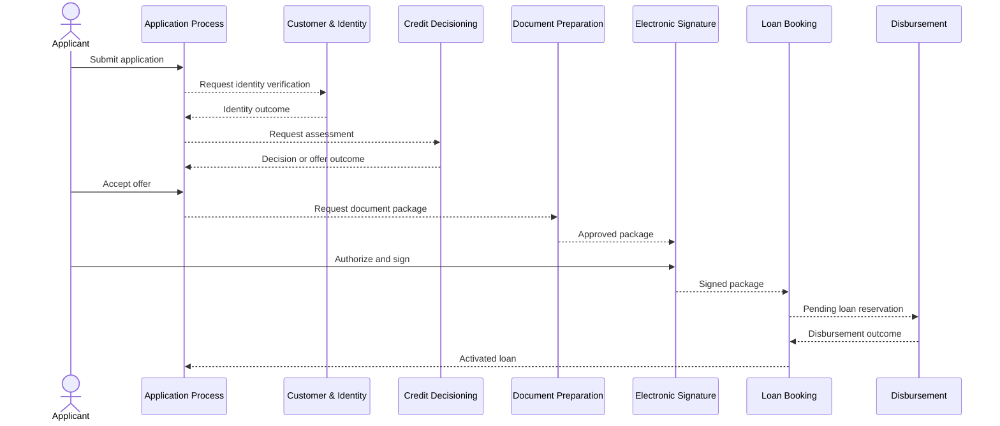
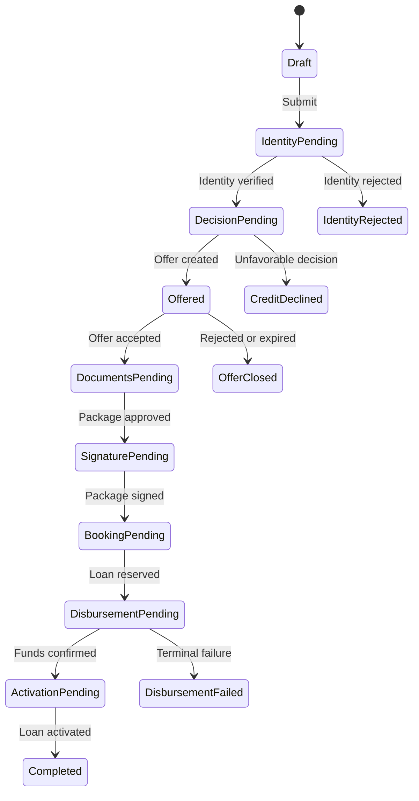

# Bounded Context Map

**Product:** Loan Onboarding & Credit Decisioning Platform

**Status:** Domain baseline 0.2

**Date:** 2026-08-12

**Scope:** Consumer-loan MVP, financially neutral domain, fictitious demo data

## 1. Purpose

This document is the strategic map of the loan-origination domain. It defines bounded-context classification, ownership, relationships, aggregate and read-model summaries, repository boundaries, and the proposed walking skeleton before service contracts are finalized.

The map distinguishes three concepts:

- **Bounded context:** a boundary in which terms and rules have one precise meaning.
- **Deployable service:** an independently released runtime. For this MVP, each core or supporting business context maps to one proposed service repository unless noted otherwise.
- **Integration event:** a versioned public fact exchanged between contexts. Internal domain events remain private.

## 2. Document authority

This document is canonical for bounded-context classification, the context and relationship maps, ownership boundaries, aggregate and read-model summaries, proposed repository boundaries, and the executive journey view.

Detailed cross-context concerns are owned by these canonical documents:

- [Business Rules](BUSINESS_RULES.md) catalogs business rules and aggregate invariants with stable IDs and lifecycle status.
- [Domain Events](DOMAIN_EVENTS.md) separates private domain events from public integration-event semantics, including producers, consumers, payload minima, exclusions, and versioning expectations.
- [Event Storming](EVENT_STORMING.md) models commands, policies, happy and alternate paths, recovery, external systems, hotspots, and open questions.

[Credit Decisioning Design](CREDIT_DECISIONING_DESIGN.md) remains canonical for the internal design of that context. [Product and Credit Policy](PRODUCT_AND_CREDIT_POLICY.md) and the [Formal Credit Decision Table](CREDIT_DECISION_TABLE.md) remain canonical for policy semantics, calculations, thresholds, matrices, reason codes, and test scenarios. Future executable schemas belong to `loan-platform-contracts`; none are defined here.

## 3. Domain classification

| Classification | Bounded context | Why |
| --- | --- | --- |
| Core | Application Process | Owns the onboarding case, lifecycle, stage progression and saga. |
| Core | Credit Decisioning | Produces an explainable approval, decline or offer from versioned rules. |
| Core | Document Preparation | Builds the contract package that expresses the accepted offer. |
| Core | Electronic Signature | Obtains signatures and preserves legal evidence. |
| Core | Disbursement | Controls the financially sensitive release of funds. |
| Core | Loan Booking | Creates and activates the loan obligation and initial schedule. |
| Supporting | Customer & Identity | Owns customer identity, consent and verification outcomes. |
| Supporting | Communications | Delivers OTPs and transactional notifications through replaceable channels. |
| Generic | Audit & Compliance Projection | Projects immutable business facts for traceability; it does not control the workflow. |
| Generic | Authentication & Authorization | Cognito-based authentication and access scopes; not a business domain service. |

## 4. Bounded context map

`Audit & Compliance Projection` subscribes to sanitized public business events and is omitted from the main path for readability. Application Process coordinates coarse journey progression; each capability context retains authority over its decisions and protected evidence.

## 5. Context responsibilities and ownership

| Context | Owns | Does not own | Primary aggregate roots | Proposed repository |
| --- | --- | --- | --- | --- |
| Application Process | Application number, selected product, current stage, stage history, customer and offer references, saga state | Customer PII, risk calculations, document bytes, loan balance | `CreditApplication`, `OnboardingProcess` | `loan-application-service` |
| Customer & Identity | Customer profile, identity identifiers, consents, verification case and evidence references | Application status, eligibility or offer | `Customer`, `IdentityVerification`, `ConsentRecord` | `customer-identity-service` |
| Credit Decisioning | Assessment inputs snapshot, affordability, bureau result, rule-set version, segment, decision, reason codes, offer terms | Authoritative customer profile, accepted offer, application workflow | `CreditAssessment`, `CreditDecision`, `CreditOffer` | `credit-decisioning-service` |
| Document Preparation | Template versions, document package, generated artifacts, approval state | Signature evidence or OTP | `DocumentTemplate`, `DocumentPackage` | `document-service` |
| Electronic Signature | Signature envelope, signers, signing state, evidence and provider reference | OTP delivery mechanics, document generation | `SignatureEnvelope` | `signature-service` |
| Communications | OTP challenge lifecycle, notification request and delivery attempts | Signature completion, customer preferences beyond required delivery data | `OtpChallenge`, `NotificationDelivery` | `communications-service` |
| Loan Booking | Pending loan reservation, contractual terms, schedule, activation state | Transfer execution or provider settlement | `LoanAccount` | `loan-account-service` |
| Disbursement | Disbursement order, destination snapshot/token, attempts, provider reference, terminal outcome | Loan schedule or lifecycle after activation | `DisbursementOrder` | `disbursement-service` |
| Audit & Compliance Projection | Append-only audit projection and trace lookup | Business decisions or process control | `AuditTrail` projection | Initially architecture/infrastructure; extract only if justified |

## 6. Context relationships

| Upstream | Downstream | DDD relationship | Contract and rule |
| --- | --- | --- | --- |
| Application Process | Customer & Identity | Customer/Supplier | Application requests onboarding; identity owns verification language and result. |
| Customer & Identity | Application Process | Published Language | Versioned identity facts; Application translates provider-specific details into process states. |
| Application Process | Credit Decisioning | Customer/Supplier | Application supplies an assessment request; Decisioning owns rule semantics and outcome. |
| Credit Decisioning | Application Process | Published Language + ACL | Application consumes only decision status, offer snapshot/reference, and reason codes. |
| Application Process | Document Preparation | Customer/Supplier | Accepted offer starts document preparation; documents copy an immutable terms snapshot. |
| Document Preparation | Electronic Signature | Published Language | Only an approved and immutable package may be submitted for signature. |
| Electronic Signature | Communications | Customer/Supplier | Signature requests an OTP challenge; it does not implement delivery. |
| Electronic Signature | Loan Booking | Published Language | A verified signed-package fact authorizes loan reservation. |
| Loan Booking | Disbursement | Published Language | A pending loan with validated destination authorizes one disbursement order. |
| Disbursement | Loan Booking | Published Language | Confirmed disbursement activates the pending loan; failure keeps it non-active. |
| All contexts | Audit projection | Open Host Service / Published Language | Audit consumes sanitized facts and must not be a synchronous dependency. |

**ACL** means anti-corruption layer: provider payloads and terminology are translated at the boundary and never leak into the domain model.

## 7. Executive journey summary

The end-to-end journey has five phases: application and identity; decision and offer; documents and approval; OTP and signature; and loan booking and disbursement. Application Process coordinates progression through references and coarse state, while rules and decisions remain inside their owning contexts.

These arrows are business interactions, not a commitment to direct service-to-service calls or published contract names. See [Event Storming](EVENT_STORMING.md) for command/policy sequences and recovery paths, and [Domain Events](DOMAIN_EVENTS.md) for event status and semantic contracts.

## 8. Aggregate and invariant summary

The ownership table identifies the proposed aggregate roots. Their consistency boundaries follow three strategic constraints: each context changes only its own aggregates; cross-context state is referenced or snapshotted rather than shared; and financially sensitive progression reserves a non-active loan before disbursement and activates it only after confirmed matching funds.

Detailed invariants, inputs, outcomes, and source traceability are canonical in [Business Rules](BUSINESS_RULES.md). Credit Decisioning formulas and matrices remain in its specialized policy and decision documents.

### `CreditApplication`

Application Process owns one coarse onboarding lifecycle per application. It advances only from complete submission data and consent references, and it stores identifiers or permitted immutable snapshots instead of foreign mutable entities.

### `DocumentPackage` and `SignatureEnvelope`

Document Preparation binds each package version to one accepted-offer snapshot and template set. Electronic Signature binds its envelope and evidence to the exact approved package; corrected or superseded content requires a new package/envelope path, and OTP validation alone is not a signature.

### `OtpChallenge`

Communications owns a single-use, expiring challenge bound to its signer, purpose, and envelope. Only a protected representation is persisted; secrets do not enter logs or events.

### `LoanAccount` and `DisbursementOrder`

Loan Booking permits at most one active account per application and keeps reservations non-active until matching funds are confirmed. Disbursement permits at most one successful transfer per reservation and preserves one stable business identity across retries.

## 9. Coarse process state

These are journey-level coordination states, not exhaustive service state machines. Alternate paths, operational failures, reconciliation, compensation, hotspots, and unresolved decisions are maintained in [Event Storming](EVENT_STORMING.md).

## 10. Read models

| Read model | Owner | Audience | Sources |
| --- | --- | --- | --- |
| Applicant Application Tracker | Application Process | Applicant | Coarse process states and safe failure reasons |
| Operations Case View | Application Process projection | Analyst | Application timeline plus references to context-specific details |
| Decision Explanation | Credit Decisioning | Analyst / demo | Inputs snapshot, partial calculations, rule version, and reason codes |
| Document Checklist | Document Preparation | Applicant | Package version, document names, and approval status |
| Signature Status | Electronic Signature | Applicant / analyst | Envelope state, signer state, and evidence metadata |
| Disbursement Receipt | Disbursement | Applicant / analyst | Amount, date, and safe provider reference |
| Loan Summary and Schedule | Loan Booking | Applicant | Activated terms and initial installments |
| Correlation Timeline | Audit & Compliance Projection | Technical reviewer | Sanitized event sequence by correlation/application ID |

No cross-context database query is allowed. Composite views use event-fed projections or API composition at the edge.

## 11. Repository boundaries derived from the model

The context map proposes eight primary service repositories:

1. `loan-application-service`
2. `customer-identity-service`
3. `credit-decisioning-service`
4. `document-service`
5. `signature-service`
6. `communications-service`
7. `loan-account-service`
8. `disbursement-service`

Platform responsibilities remain separated into:

1. `loan-platform-architecture` — domain and architecture sources, ADRs, diagrams, and roadmap.
2. `loan-platform-contracts` — future OpenAPI, AsyncAPI, JSON Schema, and examples.
3. `loan-platform-infrastructure` — shared AWS account-level and integration infrastructure.

The audit projection begins in infrastructure/observability rather than as a ninth business microservice. A separate repository is justified only if it gains its own API, retention lifecycle, or compliance ownership.

## 12. Walking skeleton summary

The proposed first demonstrable slice is:

`Submit application → Fake identity verified → Deterministic decision → Offer created → Offer accepted`

It should exercise Application Process, Customer & Identity, and Credit Decisioning; one synchronous applicant API; asynchronous cross-context facts; correlation and causation; Outbox/Inbox idempotency; favorable and unfavorable scenarios; reason codes and rule-set version; local end-to-end execution; and contract tests.

This is a planning boundary, not an implementation-complete claim. Documents, signature, loan booking, and disbursement would extend the same process after the architecture and contracts are approved.
