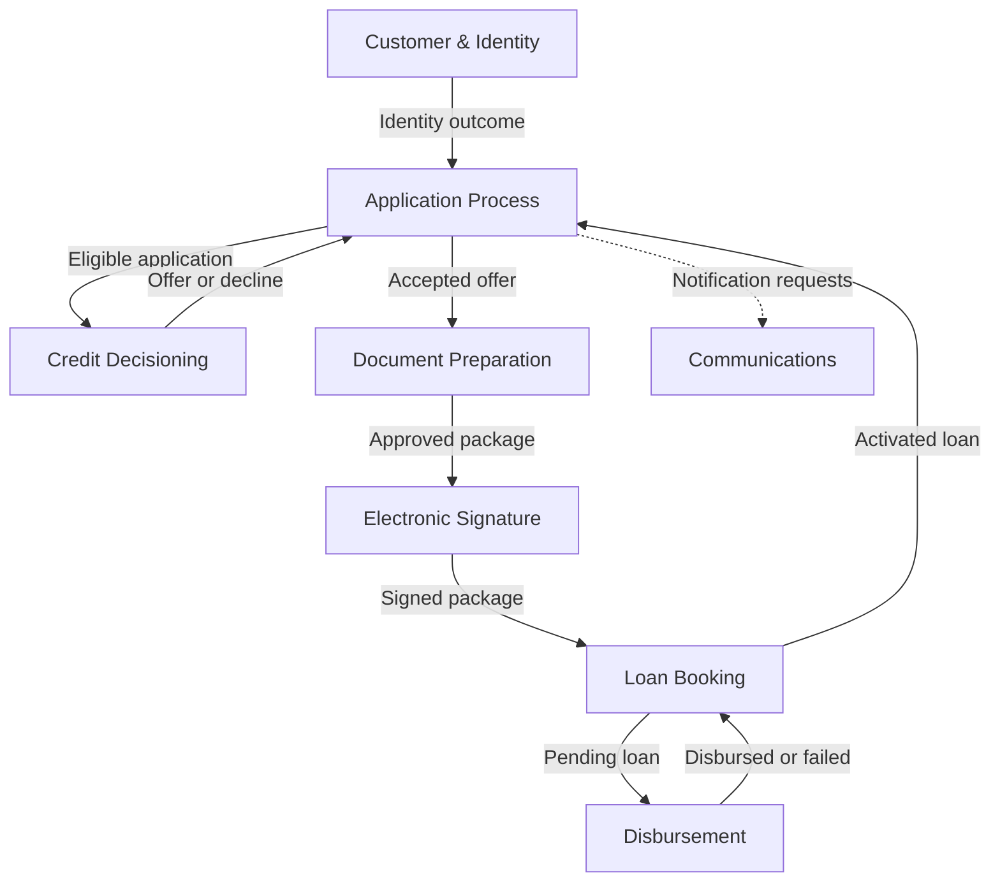
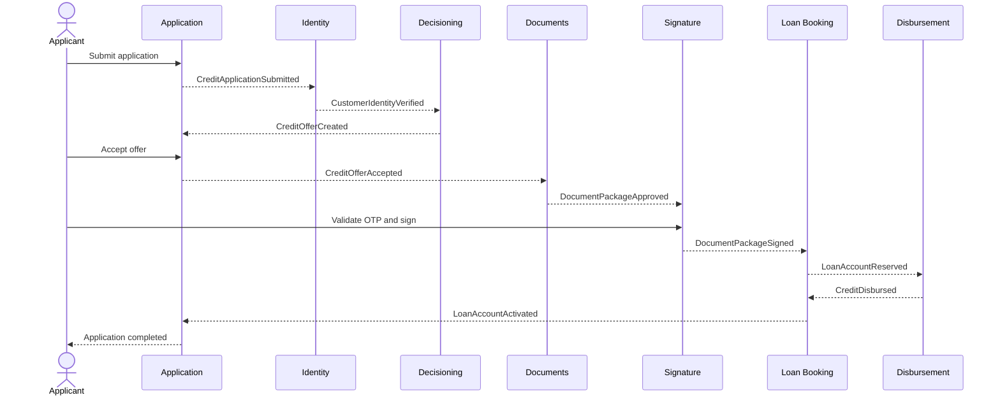
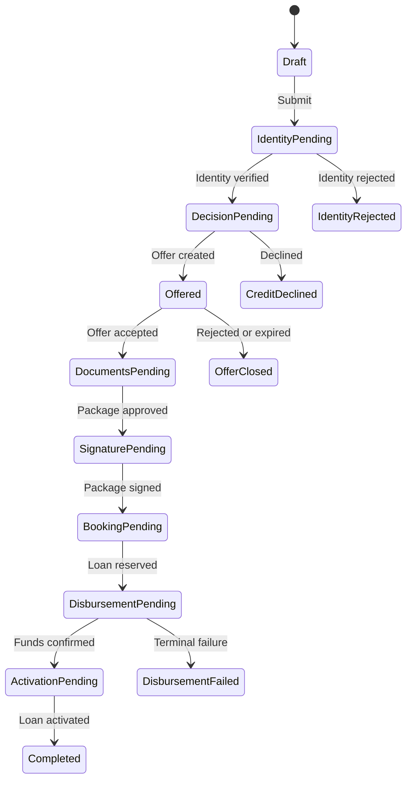

# Bounded Context Map and Event Storming

**Product:** Loan Onboarding & Credit Decisioning Platform

**Status:** Draft 0.1

**Date:** 2026-08-06

**Scope:** Consumer-loan MVP, financially neutral domain, fictitious demo data

## 1. Purpose

This document models the complete loan-origination flow before repositories and service contracts are finalized. It identifies business boundaries, ownership, commands, domain events, policies, aggregates, read models, actors, external systems, failure paths, and unresolved domain questions.

The map distinguishes three concepts:

- **Bounded context:** a boundary in which terms and rules have one precise meaning.
- **Deployable service:** an independently released runtime. For this MVP, each core bounded context maps to one service repository unless noted otherwise.
- **Integration event:** a versioned public fact exchanged between contexts. Internal domain events remain private.

## 2. Domain classification

| Classification | Bounded context | Why |
| --- | --- | --- |
| Core | Application Process | Owns the onboarding case, lifecycle, stage progression and saga. |
| Core | Credit Decisioning | Produces an explainable approval, decline or offer from versioned rules. |
| Core | Document Preparation | Builds the contract package that expresses the accepted offer. |
| Core | Electronic Signature | Obtains signatures and preserves legal evidence. |
| Core | Disbursement | Controls the financially sensitive release of funds. |
| Core | Loan Booking | Creates and activates the loan obligation and initial schedule. |
| Supporting | Customer & Identity | Owns customer identity, consent and verification outcomes. |
| Supporting | Communications | Delivers OTPs and transactional notifications through replaceable channels. |
| Generic | Audit & Compliance Projection | Projects immutable business facts for traceability; it does not control the workflow. |
| Generic | Authentication & Authorization | Cognito-based authentication and access scopes; not a business domain service. |

## 3. Bounded context map

`Audit & Compliance Projection` subscribes to the public business events of every context and is intentionally omitted from the main path to keep the diagram readable.

## 4. Context responsibilities and ownership

| Context | Owns | Does not own | Primary aggregate roots | Proposed repository |
| --- | --- | --- | --- | --- |
| Application Process | Application number, selected product, current stage, stage history, customer and offer references, saga state | Customer PII, risk calculations, document bytes, loan balance | `CreditApplication`, `OnboardingProcess` | `loan-application-service` |
| Customer & Identity | Customer profile, identity identifiers, consents, verification case and evidence references | Application status, eligibility or offer | `Customer`, `IdentityVerification`, `ConsentRecord` | `customer-identity-service` |
| Credit Decisioning | Assessment inputs snapshot, affordability, bureau result, rule set version, segment, decision, reason codes, offer terms | Authoritative customer profile, accepted offer, application workflow | `CreditAssessment`, `CreditDecision`, `CreditOffer` | `credit-decisioning-service` |
| Document Preparation | Template versions, document package, generated artifacts, approval state | Signature evidence or OTP | `DocumentTemplate`, `DocumentPackage` | `document-service` |
| Electronic Signature | Signature envelope, signers, signing state, evidence and provider reference | OTP delivery mechanics, document generation | `SignatureEnvelope` | `signature-service` |
| Communications | OTP challenge lifecycle, notification request and delivery attempts | Signature completion, customer preferences beyond required delivery data | `OtpChallenge`, `NotificationDelivery` | `communications-service` |
| Loan Booking | Pending loan reservation, contractual terms, schedule, activation state | Transfer execution or provider settlement | `LoanAccount` | `loan-account-service` |
| Disbursement | Disbursement order, destination snapshot/token, attempts, provider reference, terminal outcome | Loan schedule or lifecycle after activation | `DisbursementOrder` | `disbursement-service` |
| Audit & Compliance Projection | Append-only audit projection and trace lookup | Business decisions or process control | `AuditTrail` projection | Initially part of architecture/infrastructure; extract only if justified |

## 5. Context relationships

| Upstream | Downstream | DDD relationship | Contract and rule |
| --- | --- | --- | --- |
| Application Process | Customer & Identity | Customer/Supplier | Application requests onboarding; identity owns verification language and result. |
| Customer & Identity | Application Process | Published Language | Versioned identity events; Application translates provider-specific details into process states. |
| Application Process | Credit Decisioning | Customer/Supplier | Application supplies an assessment request; Decisioning owns rule semantics and outcome. |
| Credit Decisioning | Application Process | Published Language + ACL | Application consumes only decision status, offer snapshot/reference and reason codes. |
| Application Process | Document Preparation | Customer/Supplier | Accepted offer starts document preparation; documents copy an immutable terms snapshot. |
| Document Preparation | Electronic Signature | Published Language | Only an approved and immutable package may be submitted for signature. |
| Electronic Signature | Communications | Customer/Supplier | Signature requests an OTP challenge; it never implements SMS delivery. |
| Electronic Signature | Loan Booking | Published Language | A verified signed-package event authorizes loan reservation. |
| Loan Booking | Disbursement | Published Language | A pending loan with validated destination authorizes one disbursement order. |
| Disbursement | Loan Booking | Published Language | Confirmed disbursement activates the pending loan; failure keeps it non-active. |
| All contexts | Audit projection | Open Host Service / Published Language | Audit consumes facts and must not be a synchronous dependency. |

**ACL** means anti-corruption layer: provider payloads and terminology are translated at the boundary and never leak into the domain model.

## 6. Big-picture event storming

Legend:

- **Actor** initiates behavior.
- **Command** expresses intent in imperative form.
- **Aggregate** validates invariants and changes state.
- **Domain event** is a past-tense business fact.
- **Policy** reacts to an event and issues the next command.
- **Read model** supports a decision or user view.

### Phase A — Application and identity

| # | Actor / trigger | Command | Aggregate | Domain or integration event | Policy / next action | Read model |
| --- | --- | --- | --- | --- | --- | --- |
| 1 | Applicant | `StartCreditApplication` | CreditApplication | `CreditApplicationStarted` | Allow applicant data capture | Application Summary |
| 2 | Applicant | `RegisterCustomerProfile` | Customer | `CustomerProfileRegistered` | Request required consents | Customer Profile |
| 3 | Applicant | `GrantConsent` | ConsentRecord | `CustomerConsentGranted` | When all required consents exist, allow submission | Consent Status |
| 4 | Applicant | `SubmitCreditApplication` | CreditApplication | `CreditApplicationSubmitted` | Request identity verification | Application Tracker |
| 5 | Identity policy | `StartIdentityVerification` | IdentityVerification | `IdentityVerificationStarted` | Invoke identity-provider adapter | Verification Status |
| 6A | Identity provider | `RecordIdentityVerification` | IdentityVerification | `CustomerIdentityVerified` | Request credit assessment | Verification Result |
| 6B | Identity provider | `RecordIdentityRejection` | IdentityVerification | `CustomerIdentityRejected` | Reject application and notify applicant | Rejection Explanation |

### Phase B — Decision and offer

| # | Actor / trigger | Command | Aggregate | Domain or integration event | Policy / next action | Read model |
| --- | --- | --- | --- | --- | --- | --- |
| 7 | Identity verified policy | `RequestCreditAssessment` | CreditAssessment | `CreditAssessmentRequested` | Gather declared financial data and simulated bureau signals | Assessment Inputs |
| 8 | Decision engine | `EvaluateAffordability` | CreditAssessment | `PaymentCapacityCalculated` | Evaluate risk with same immutable input snapshot | Assessment Breakdown |
| 9 | Decision engine | `EvaluateRisk` | CreditAssessment | `RiskEvaluated` | Assign customer segment | Risk Explanation |
| 10 | Decision engine | `AssignCustomerSegment` | CreditAssessment | `CustomerSegmentAssigned` | Apply product eligibility and pricing rules | Segment View |
| 11A | Decision engine | `RecordFavorableCreditDecision` | CreditDecision | `FavorableCreditDecisionRecorded` | Generate offer | Decision Explanation |
| 11B | Decision engine | `RecordUnfavorableCreditDecision` | CreditDecision | `UnfavorableCreditDecisionRecorded`; publish `CreditApplicationDeclined` | Close process and notify applicant | Decline Reasons |
| 12 | Approval policy | `CreateCreditOffer` | CreditOffer | `CreditOfferCreated` | Present immutable offer with expiry | Offer Details |
| 13A | Applicant | `AcceptCreditOffer` | CreditOffer | `CreditOfferAccepted` | Generate document package | Offer Details |
| 13B | Applicant | `RejectCreditOffer` | CreditOffer | `CreditOfferRejected` | Close application | Application Tracker |
| 13C | Clock | `ExpireCreditOffer` | CreditOffer | `CreditOfferExpired` | Close or allow a new assessment by explicit policy | Expired Offer View |

### Phase C — Documents and approval

| # | Actor / trigger | Command | Aggregate | Domain or integration event | Policy / next action | Read model |
| --- | --- | --- | --- | --- | --- | --- |
| 14 | Offer accepted policy | `GenerateDocumentPackage` | DocumentPackage | `DocumentPackageGenerated` | Make package available for review | Document Checklist |
| 15A | Applicant | `ApproveDocumentPackage` | DocumentPackage | `DocumentPackageApproved` | Create signature envelope | Document Viewer |
| 15B | Applicant | `RequestDocumentCorrection` | DocumentPackage | `DocumentCorrectionRequested` | Invalidate package and route to regeneration/manual review | Document Viewer |
| 16 | Approved-package policy | `CreateSignatureEnvelope` | SignatureEnvelope | `SignatureEnvelopeCreated` | Request OTP challenge | Signature Status |

### Phase D — OTP and signature

| # | Actor / trigger | Command | Aggregate | Domain or integration event | Policy / next action | Read model |
| --- | --- | --- | --- | --- | --- | --- |
| 17 | Signature service | `IssueOtpChallenge` | OtpChallenge | `OtpChallengeIssued` | Deliver OTP through configured channel | Masked Delivery Status |
| 18 | Communications adapter | `RecordOtpDelivery` | NotificationDelivery | `OtpDelivered` or `OtpDeliveryFailed` | Allow retry within policy; never expose OTP value | Delivery Status |
| 19A | Applicant | `ValidateOtp` | OtpChallenge | `OtpValidated` | Authorize signature once | OTP Attempt Status |
| 19B | Applicant | `ValidateOtp` | OtpChallenge | `OtpValidationFailed` | Increment attempts; lock at limit | OTP Attempt Status |
| 19C | Clock | `ExpireOtpChallenge` | OtpChallenge | `OtpExpired` | Permit controlled reissue | Signature Status |
| 20 | OTP validated policy | `SignDocumentPackage` | SignatureEnvelope | `DocumentPackageSigned` | Reserve pending loan account | Signature Evidence |

### Phase E — Loan booking and disbursement

| # | Actor / trigger | Command | Aggregate | Domain or integration event | Policy / next action | Read model |
| --- | --- | --- | --- | --- | --- | --- |
| 21 | Signed-package policy | `ReserveLoanAccount` | LoanAccount | `LoanAccountReserved` | Create a disbursement order | Loan Booking Status |
| 22 | Reservation policy | `CreateDisbursementOrder` | DisbursementOrder | `DisbursementOrderCreated` | Validate destination and execute once | Disbursement Status |
| 23 | Disbursement policy | `ExecuteDisbursement` | DisbursementOrder | `DisbursementRequested` | Call fake payment provider with idempotency key | Disbursement Status |
| 24A | Payment provider | `ConfirmDisbursement` | DisbursementOrder | `CreditDisbursed` | Activate reserved loan | Disbursement Receipt |
| 24B | Payment provider | `FailDisbursement` | DisbursementOrder | `CreditDisbursementFailed` | Retry if transient; otherwise cancel reservation/manual review | Failure Details |
| 25 | Disbursement confirmed policy | `ActivateLoanAccount` | LoanAccount | `LoanAccountActivated` | Complete application and notify applicant | Loan Summary & Schedule |
| 26 | Activation policy | `CompleteCreditApplication` | CreditApplication | `CreditApplicationCompleted` | Send welcome/disbursement notification | Application Tracker |

## 7. Happy-path event timeline

The sequence shows business messages, not direct service-to-service calls. EventBridge routes events to a dedicated SQS queue per consumer. Commands that require immediate user feedback may use synchronous APIs, while cross-context progression remains event-driven.

## 8. Key policies

| Policy | Trigger | Command | Guard / invariant |
| --- | --- | --- | --- |
| Start identity | Application submitted | Start identity verification | Required fields and consent set complete; submission idempotent. |
| Start decision | Identity verified | Request credit assessment | Identity result valid and not expired. |
| Generate offer | Decision approved | Create credit offer | Terms derived from one rule-set version and input snapshot. |
| Prepare documents | Offer accepted | Generate document package | Offer active, unexpired and accepted exactly once. |
| Start signing | Package approved | Create signature envelope | Approved package immutable and hash recorded. |
| Authorize signing | OTP validated | Sign package | Challenge unexpired, unused, below attempt limit and bound to envelope/signer. |
| Reserve loan | Package signed | Reserve loan account | Signature evidence valid; uniqueness by application ID. |
| Disburse | Loan reserved | Execute disbursement | Pending loan exists; destination validated; idempotency key stable. |
| Activate loan | Credit disbursed | Activate loan account | Amount/reference match reservation; activation idempotent. |
| Complete application | Loan activated | Complete application | Activated account belongs to application and accepted offer. |

## 9. Aggregate invariants

### CreditApplication

- An application cannot be submitted without required customer data and consent references.
- Only one active onboarding process exists per application.
- Terminal applications cannot advance without an explicit reopen policy.
- The application stores references and snapshots needed for traceability, not copies of all other contexts' mutable entities.

### CreditDecision and CreditOffer

- A decision is immutable after publication; reevaluation creates a new assessment/decision version.
- Every decline contains one or more stable reason codes.
- Every offer records the decision ID, rule-set version, amount, currency, rate, term and expiry.
- Only an active, unexpired offer may be accepted; accepted terms become immutable.

### DocumentPackage and SignatureEnvelope

- Generated documents reference one accepted-offer snapshot and template versions.
- Changing terms or an approved document invalidates the existing package and signature envelope.
- A signed package records hashes of exactly the documents the applicant reviewed.
- OTP validation does not by itself mean that documents were signed; it only authorizes the signing command.

### OtpChallenge

- OTP is stored as a salted hash, expires, has a maximum number of attempts and can be used once.
- A challenge is bound to purpose, signer and signature envelope.
- Logs and events never contain the secret value.

### LoanAccount and DisbursementOrder

- One application can produce at most one active loan account.
- A reserved loan is not an active receivable and cannot accrue interest.
- One reservation produces at most one successful disbursement.
- Provider retries reuse the same idempotency key.
- A loan activates only after confirmed disbursement with matching amount, currency and reservation reference.

## 10. Failure and compensation paths

| Failure / event | Process state | Response | Compensation or recovery |
| --- | --- | --- | --- |
| `CustomerIdentityRejected` | `IdentityRejected` | Stop decisioning; notify with safe reason | New verification requires an explicit retry/reopen command. |
| Identity provider timeout | `IdentityPending` | Retry asynchronously, then DLQ/manual review | No business compensation; no downstream work occurred. |
| `CreditApplicationDeclined` | `CreditDeclined` | Close process with reason codes | Reevaluation creates a new decision version; do not mutate old decision. |
| `CreditOfferExpired` | `OfferExpired` | Prevent acceptance | Request reassessment or issue a new offer under current rules. |
| `DocumentCorrectionRequested` | `DocumentsPending` | Invalidate package/envelope | Regenerate new package version; retain prior audit evidence. |
| OTP attempt limit reached | `SignatureBlocked` | Block signing temporarily | Controlled reissue or manual review; old challenge remains unusable. |
| Signature provider timeout | `SignaturePending` | Query by idempotency key before retry | Never assume failure after an ambiguous provider response. |
| Loan reservation failure | `BookingFailed` | Do not disburse | Retry or manual review; signed documents remain auditable. |
| Disbursement transient failure | `DisbursementPending` | Retry with same key | Exponential backoff; reconcile unknown provider results. |
| Disbursement terminal failure | `DisbursementFailed` | Stop activation and notify operations | Cancel/expire pending loan reservation; no active loan is created. |
| Activation failure after confirmed disbursement | `ActivationPending` critical | Reconcile and retry activation | Never reverse automatically without an explicit financial reversal workflow. |
| Duplicate/out-of-order event | Unchanged | Ignore safely and record metric | Inbox/idempotency record plus optimistic concurrency. |

## 11. Process state model

The detailed service states remain inside their owning contexts. `Application Process` maintains only the coarse-grained customer journey and correlation references.

## 12. Public integration-event catalog v0

Events below are candidates for the shared contracts repository. Names are shown without `.v1`; the version belongs in both schema identity and event type.

| Producer | Integration event | Minimum business payload |
| --- | --- | --- |
| Application | `CreditApplicationSubmitted` | application ID, customer ID, product ID, consent references, submission timestamp |
| Customer & Identity | `CustomerIdentityVerified` | application/customer IDs, verification ID, provider-neutral level, valid-until |
| Customer & Identity | `CustomerIdentityRejected` | application/customer IDs, verification ID, safe reason codes |
| Decisioning | `CreditOfferCreated` | application, decision and offer IDs; amount, currency, rate, term, expiry, rule-set version |
| Decisioning | `CreditApplicationDeclined` | application and decision IDs, reason codes, rule-set version |
| Application | `CreditOfferAccepted` | application and offer IDs, accepted timestamp, accepted-terms hash |
| Application | `CreditOfferRejected` | application and offer IDs, timestamp |
| Documents | `DocumentPackageGenerated` | application, offer and package IDs, package version, document references |
| Documents | `DocumentPackageApproved` | application/package IDs, version, package hash, approval timestamp |
| Signature | `DocumentPackageSigned` | application/package/envelope IDs, signer references, evidence reference, signed timestamp |
| Loan Booking | `LoanAccountReserved` | application, loan and offer IDs, amount, currency, destination token/reference |
| Disbursement | `CreditDisbursed` | application, loan and order IDs, amount, currency, provider reference, timestamp |
| Disbursement | `CreditDisbursementFailed` | application, loan and order IDs, retryability, safe reason code |
| Loan Booking | `LoanAccountActivated` | application and loan IDs, account number/token, schedule version, activation timestamp |
| Application | `CreditApplicationCompleted` | application, customer and loan IDs, completion timestamp |

OTP and notification events should remain private to their consumers unless another bounded context has a genuine business need. Audit can consume sanitized operational events, but the shared catalog must not expose OTP secrets, raw identity evidence, full customer PII or document bytes.

## 13. Read models

| Read model | Owner | Audience | Sources |
| --- | --- | --- | --- |
| Applicant Application Tracker | Application | Applicant | Coarse process states and safe failure reasons |
| Operations Case View | Application projection | Analyst | Application timeline plus references to context-specific details |
| Decision Explanation | Decisioning | Analyst / demo | Inputs snapshot, partial calculations, rule version and reason codes |
| Document Checklist | Documents | Applicant | Package version, document names and approval status |
| Signature Status | Signature | Applicant / analyst | Envelope state, signer state and evidence metadata |
| Disbursement Receipt | Disbursement | Applicant / analyst | Amount, date and safe provider reference |
| Loan Summary and Schedule | Loan Booking | Applicant | Activated terms and initial installments |
| Correlation Timeline | Audit projection | Technical reviewer | Sanitized event sequence by correlation/application ID |

No cross-context database query is allowed. Composite views use event-fed projections or API composition at the edge.

## 14. Hotspots and decisions required

| ID | Hotspot | Recommended default for MVP | Consequence |
| --- | --- | --- | --- |
| H-01 | Loan creation before or after disbursement | Reserve `PendingDisbursement` loan before transfer; activate after confirmation | Prevents releasing funds without a bookable obligation. |
| H-02 | Manual credit-review path | Exclude from first walking skeleton; model `ManualReviewRequired` as a future terminal/pause state | Keeps MVP finite without blocking extension. |
| H-03 | Joint applicants / guarantors | Single borrower only | Avoids signer and eligibility complexity in v1. |
| H-04 | Multiple offers | One active offer per application; new offer supersedes previous unaccepted offer | Simplifies acceptance and document invariants. |
| H-05 | Offer acceptance authority | Applicant with authenticated session and explicit consent | Requires audit timestamp and terms hash. |
| H-06 | Document approval meaning | Applicant confirms review before signature; not internal underwriting approval | Keeps vocabulary unambiguous. |
| H-07 | OTP ownership | Communications owns challenge validation; Signature consumes only outcome | Avoids duplicating security logic. |
| H-08 | Disbursement destination | Tokenized/simulated bank destination, never raw credentials | Safer public demo. |
| H-09 | Cancellation boundary | Applicant may cancel until signing; after signing requires operations workflow | Prevents unsafe implicit compensation. |
| H-10 | PII in events | IDs and minimum snapshots only; sensitive evidence remains behind owning API | Reduces propagation and audit exposure. |

## 15. Repository boundaries derived from the model

The event storming supports eight primary service repositories:

1. `loan-application-service`
2. `customer-identity-service`
3. `credit-decisioning-service`
4. `document-service`
5. `signature-service`
6. `communications-service`
7. `loan-account-service`
8. `disbursement-service`

Plus three platform repositories:

1. `loan-platform-architecture` — this document, ADRs, diagrams and roadmap.
2. `loan-platform-contracts` — OpenAPI, AsyncAPI, JSON Schema and examples.
3. `loan-platform-infrastructure` — shared AWS account-level and integration infrastructure.

The audit projection begins in infrastructure/observability rather than as a ninth business microservice. A separate repository is justified only when it gains its own API, retention lifecycle or compliance ownership.

## 16. Walking skeleton slice

The first demonstrable vertical slice should prove the boundaries with the smallest valuable path:

`Submit application → Fake identity verified → Deterministic decision → Offer created → Offer accepted`

It must include:

- Application, Customer & Identity, and Credit Decisioning services;
- one synchronous applicant API and asynchronous cross-context events;
- event envelope, correlation and causation IDs;
- transactional outbox/inbox idempotency strategy;
- one approved and one declined scenario;
- decision reason codes and rule-set version;
- local end-to-end execution and contract tests.

Documents, signature, loan booking and disbursement extend the same process 
