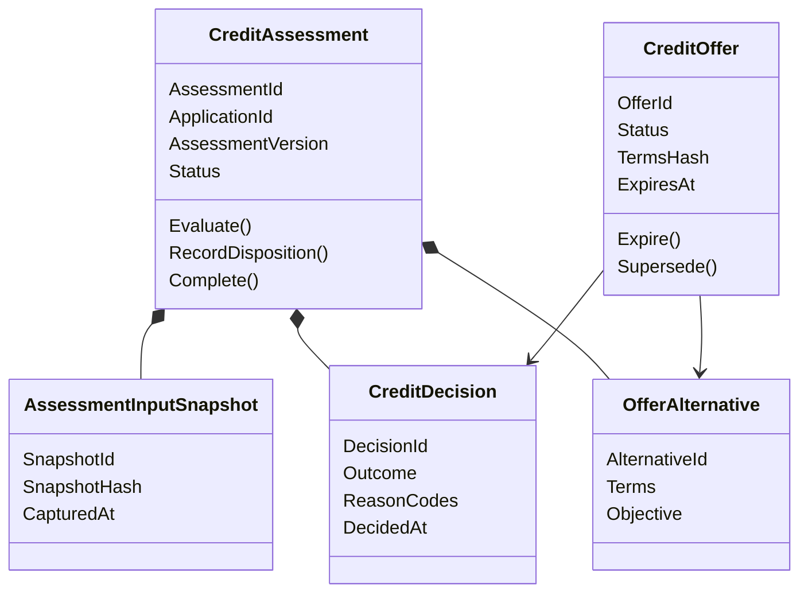
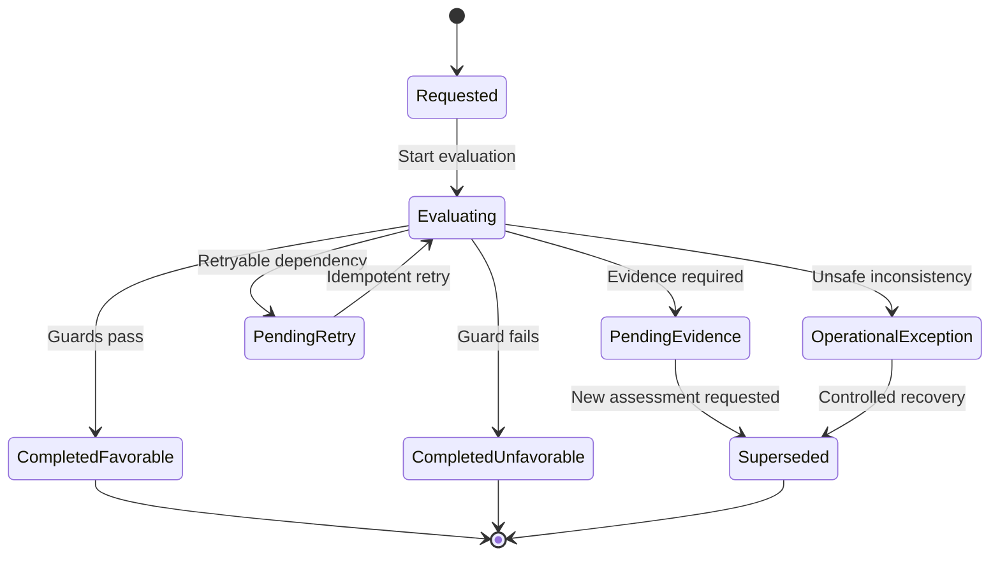

# Credit Decisioning Bounded Context Design

**Product:** Loan Onboarding & Credit Decisioning Platform  
**Repository:** `credit-decisioning-service`  
**Status:** Proposed baseline v0.1  
**Date:** 2026-08-06  
**Canonical language:** English  
**Runtime target:** .NET 10 on AWS Lambda ARM64  
**Policy baseline:** `QuickPersonalLoanPolicy.v1`

## 1. Purpose

This document translates the formal credit decision table into the internal design of the Credit Decisioning bounded context. It defines the ownership boundary, aggregate model, invariants, value objects, domain services, use cases, ports, persistence model, commands, events and implementation slices for `credit-decisioning-service`.

The design is specification-first. No code path may produce a credit outcome unless it is traceable to a published decision-table rule ID.

## 2. Context responsibility

Credit Decisioning owns:

- immutable assessment input snapshots;
- deterministic assessment execution;
- operational dispositions that prevent a safe decision;
- affordability, risk-band and segment treatment;
- immutable favorable or unfavorable credit decisions;
- offer alternatives derived from favorable decisions;
- creation, expiry and supersession of credit offers;
- rule-set and calculation-policy versions used by every result;
- applicant-safe and restricted reason-code classifications.

Credit Decisioning does **not** own:

- the authoritative customer profile or identity evidence;
- the end-to-end application state machine;
- consent capture;
- acceptance or rejection of an offer by the applicant;
- document generation, signature, loan booking or disbursement;
- raw provider payloads;
- localization of customer-facing messages;
- manual review in MVP v1.

## 3. Context relationships

| Collaborator | Relationship | Input to Credit Decisioning | Output from Credit Decisioning |
| --- | --- | --- | --- |
| Application Process | Upstream customer / downstream supplier | `CreditAssessmentRequested.v1`, `CreditOfferSelectionRequested.v1` | assessment disposition, decision and offer events |
| Customer & Identity | Upstream published language through Application snapshot | verified identity status, evidence references and safe fraud signals | no direct write or database access |
| Loan Account | Upstream exposure snapshot through Application | active-loan indicator | no direct command |
| Contracts repository | Published language | versioned JSON Schemas | versioned integration events |
| Simulated scoring provider | Outbound ACL port | provider-neutral assessment request | normalized score/evidence result |

No service-to-service database queries are allowed. Required facts are supplied in the immutable request snapshot. Provider-specific fields are translated by an anti-corruption layer before entering the domain.

## 4. Domain model overview



## 5. Aggregate boundaries

### 5.1 `CreditAssessment` aggregate root

`CreditAssessment` is the primary aggregate. One instance represents one reproducible evaluation attempt for an application using exactly one immutable input snapshot and one immutable policy version.

Core state:

| Field | Meaning |
| --- | --- |
| `AssessmentId` | Globally unique assessment identifier |
| `ApplicationId` | Application being assessed |
| `CustomerId` | Non-PII customer reference |
| `AssessmentVersion` | Monotonic version for this application |
| `PreviousAssessmentId` | Optional link when explicitly reevaluated |
| `InputSnapshot` | Immutable normalized facts and evidence references |
| `PolicyVersion` | Exact rule set, thresholds and priorities |
| `FormulaVersion` | Exact affordability and pricing calculations |
| `Status` | Assessment lifecycle state |
| `OperationalDisposition` | Present only when safe completion is blocked |
| `Decision` | Present only after completed credit evaluation |
| `Alternatives` | Zero to three alternatives for a favorable decision |
| `CreatedAt` / `CompletedAt` | UTC instants |

Lifecycle:



Invariants:

1. An assessment references exactly one input snapshot, policy version and formula version.
2. The snapshot cannot change after creation.
3. A completed assessment has exactly one `CreditDecision`.
4. An assessment with an operational disposition has no `CreditDecision`.
5. `Favorable` requires at least one and at most three distinct eligible alternatives.
6. `Unfavorable` has no alternatives and at least one permitted reason code.
7. `PrimaryReasonCode` must follow the decision-table priority.
8. Provider failures cannot produce `Unfavorable`.
9. Reevaluation creates a new aggregate and links the previous assessment; it never mutates a published decision.
10. The same normalized snapshot plus policy/formula versions must produce the same business result.

### 5.2 `CreditOffer` aggregate root

`CreditOffer` is a separate aggregate because its lifecycle continues after assessment completion and is subject to concurrent selection, expiry and supersession. It represents one selected alternative, not the entire list of alternatives.

Core state:

| Field | Meaning |
| --- | --- |
| `OfferId` | Globally unique offer identifier |
| `ApplicationId` / `CustomerId` | Correlation references |
| `AssessmentId` / `DecisionId` | Originating favorable result |
| `AlternativeId` | Selected evaluated alternative |
| `Terms` | Immutable principal, rate, installment, term and totals |
| `TermsHash` | Deterministic digest of canonical terms |
| `Status` | `Active`, `Expired` or `Superseded` |
| `CreatedAt` / `ExpiresAt` | UTC instants |
| `SupersededByOfferId` | Optional replacement reference |

Invariants:

1. An offer can be created only from an alternative belonging to a favorable decision.
2. Offer terms must exactly equal the selected alternative; clients cannot submit replacement monetary terms.
3. Terms are immutable after creation.
4. `ExpiresAt = CreatedAt + policy OfferValidity`.
5. At most one active offer exists per application.
6. Expiry and supersession are terminal and idempotent.
7. Acceptance is not a state of this aggregate in MVP; Application Process owns the applicant action and records the accepted immutable snapshot.

## 6. Value objects

| Value object | Key validations / behavior |
| --- | --- |
| `Money` | Decimal amount + ISO 4217 currency; same-currency arithmetic only; policy rounding |
| `Percentage` | Decimal normalized value; explicit precision; no implicit percent/ratio conversion |
| `MonthlyEffectiveRate` | Non-negative percentage; source of truth for payment calculations |
| `AnnualEffectiveRate` | Derived value only: `(1 + monthlyRate)^12 - 1` |
| `LoanTerm` | Positive integer months; allowed values come from policy |
| `MonthlyInstallment` | Money greater than zero for an eligible alternative |
| `PaymentCapacity` | Maximum total debt service and available installment |
| `RiskScore` | Integer 0–1,000; outside range is operational inconsistency |
| `RiskBand` | `Low`, `Medium`, `High`; derived from versioned policy |
| `CustomerSegment` | `New`, `Standard`, `Preferred`; independent of risk band |
| `ReasonCode` | Stable code + category + disclosure classification + source rule ID |
| `PolicyVersion` | Immutable semantic identifier such as `QuickPersonalLoanPolicy.v1` |
| `FormulaVersion` | Immutable calculation identifier such as `FixedPaymentFormula.v1` |
| `SnapshotHash` | SHA-256 over canonical normalized input; excludes transport metadata |
| `TermsHash` | SHA-256 over canonical immutable offer terms |
| `EvidenceReference` | Opaque reference, type, source and evidence timestamp; no raw evidence |
| `IdempotencyKey` | Non-empty caller-scoped key with bounded length |

All domain identifiers are strongly typed. Primitive strings must not be passed between domain operations when `AssessmentId`, `DecisionId`, `OfferId`, `ApplicationId` or `CustomerId` expresses the meaning.

## 7. Entities inside `CreditAssessment`

### `CreditDecision`

An immutable entity created exactly once when evaluation completes.

- `DecisionId`
- `Outcome`: `Favorable` or `Unfavorable`
- `PrimaryReasonCode`
- internal and publicly permitted reason-code collections
- `RiskScore`, `RiskBand`, `CustomerSegment`
- selected exposure caps and limiting-cap reason
- affordability result
- rule evaluation trace
- `DecidedAt`

### `OfferAlternative`

An immutable evaluated option contained by a favorable assessment.

- `AlternativeId`
- `Objective`: `RequestedOrMaximumAmount`, `LowestInstallment`, `LowestTotalCost`
- `OfferTerms`
- applicable risk, segment and product caps
- `ConstrainedBy`
- formula inputs and rounded outputs

Duplicate alternatives are eliminated by canonical `OfferTerms` equality, not by objective label.

### `RuleEvaluation`

Protected decision evidence:

- rule ID and policy version;
- evaluated/not-evaluated status;
- effect and priority;
- normalized non-sensitive inputs;
- internal reason code;
- evaluation timestamp.

This trace is persisted but never emitted as a full public event.

## 8. Domain services

Domain services are stateless and deterministic. They receive domain values and published policies; they do not call repositories, clocks, providers or message buses.

| Service | Responsibility |
| --- | --- |
| `AssessmentPrerequisiteEvaluator` | Evaluates `OP-*` rules and returns operational disposition |
| `EligibilityGuardEvaluator` | Applies prioritized `G-001` through `G-010` guards |
| `RiskClassifier` | Validates score range and derives `RiskBand` |
| `CustomerSegmentClassifier` | Applies versioned commercial segmentation rules |
| `PaymentCapacityCalculator` | Calculates PTI limit and available monthly installment |
| `AffordablePrincipalCalculator` | Applies fixed-payment present-value formula per term |
| `PricingCalculator` | Combines risk rate and segment adjustment with floor |
| `OfferAlternativeBuilder` | Evaluates supported terms, caps, installments and objectives |
| `CreditDecisionEngine` | Executes the ordered pipeline and creates the domain result |
| `TermsHasher` | Produces deterministic hash from canonical offer terms |

The engine returns a domain discriminated result:

```text
AssessmentEvaluationResult
├── OperationalDispositionResult
│   ├── PendingEvidence
│   ├── PendingRetry
│   └── OperationalException
└── CompletedDecisionResult
    ├── Favorable + 1..3 OfferAlternatives
    └── Unfavorable + ReasonCodes
```

`ValidationError` is returned before aggregate creation and is therefore an application-layer result, not a persisted assessment state.

## 9. Application use cases

### UC-CD-001 — Request credit assessment

**Trigger:** `CreditAssessmentRequested.v1`  
**Idempotency scope:** event ID + application assessment version

1. Validate contract and required identifiers.
2. Reject syntactically invalid input without creating an assessment (`OP-001`).
3. Normalize the published snapshot and calculate `SnapshotHash`.
4. Resolve immutable policy and formula versions.
5. Create `CreditAssessment` in `Requested`.
6. Execute prerequisite and decision pipelines.
7. Persist assessment, decision/alternatives and outbox atomically.
8. Publish exactly one terminal fact for this execution.

Possible facts:

- `CreditAssessmentPendingEvidence.v1`
- `CreditAssessmentPendingRetry.v1`
- `CreditAssessmentOperationalExceptionRecorded.v1`
- `FavorableCreditDecisionRecorded.v1`
- `UnfavorableCreditDecisionRecorded.v1`

### UC-CD-002 — Retry pending assessment

**Trigger:** scheduled/internal retry command or redelivery after a retryable provider result.

- allowed only for `PendingRetry`;
- reuses the original `AssessmentId`, snapshot and policy versions;
- records retry attempt metadata outside the deterministic business result;
- must not duplicate a completed decision or integration event.

### UC-CD-003 — Request explicit reassessment

Creates a new assessment version when an authorized upstream process supplies a new immutable snapshot or explicitly selects a newer policy. It links `PreviousAssessmentId` and supersedes any unaccepted active offer through a separate use case.

### UC-CD-004 — Create credit offer

**Command:** `CreateCreditOffer`

Inputs contain identifiers only: application, decision and selected alternative. The server loads the favorable assessment and reconstructs terms from the stored alternative.

Results:

- active immutable `CreditOffer`;
- `CreditOfferCreated.v1` in the same atomic unit as the offer and outbox record.

### UC-CD-005 — Expire credit offer

An EventBridge schedule or lazy expiry check issues `ExpireCreditOffer`. The aggregate compares the injected current instant to `ExpiresAt`, changes `Active` to `Expired` once and emits `CreditOfferExpired.v1`.

### UC-CD-006 — Supersede credit offer

When a valid reassessment produces a replacement selection, the previous active offer becomes `Superseded`, links the replacement and emits `CreditOfferSuperseded.v1`.

### UC-CD-007 — Query assessment or active offer

Returns a sanitized projection for Application Process or demo UI. Restricted fraud details, raw evidence, provider payloads and internal rule traces are excluded.

## 10. Commands

| Command | Handler | Aggregate | Preconditions |
| --- | --- | --- | --- |
| `RequestCreditAssessment` | `RequestCreditAssessmentHandler` | New `CreditAssessment` | valid contract and no same-version assessment |
| `RetryCreditAssessment` | `RetryCreditAssessmentHandler` | `CreditAssessment` | status `PendingRetry` |
| `RequestCreditReassessment` | `RequestCreditReassessmentHandler` | New `CreditAssessment` | new version and authorized cause |
| `CreateCreditOffer` | `CreateCreditOfferHandler` | New `CreditOffer` | favorable decision + owned alternative |
| `ExpireCreditOffer` | `ExpireCreditOfferHandler` | `CreditOffer` | active and current instant >= expiry |
| `SupersedeCreditOffer` | `SupersedeCreditOfferHandler` | `CreditOffer` | active and replacement offer exists |

Commands are internal application messages. Integration consumers receive versioned event contracts and translate them into these commands.

## 11. Domain events

Domain events remain internal to the repository:

- `CreditAssessmentStarted`
- `AssessmentDispositionRecorded`
- `CreditDecisionRecorded`
- `OfferAlternativesCalculated`
- `CreditOfferCreated`
- `CreditOfferExpired`
- `CreditOfferSuperseded`

They may carry rich domain types. They are not published directly to EventBridge.

## 12. Integration events

| Event | Minimum public payload | Consumer intent |
| --- | --- | --- |
| `CreditAssessmentPendingEvidence.v1` | IDs, safe reason codes, required evidence categories | Application requests additional evidence |
| `CreditAssessmentPendingRetry.v1` | IDs, generic code, retry-after hint | Application shows processing state |
| `CreditAssessmentOperationalExceptionRecorded.v1` | IDs, generic code, recovery reference | controlled operations recovery |
| `FavorableCreditDecisionRecorded.v1` | IDs, risk band, segment, sanitized alternatives, policy versions | Application displays alternatives |
| `UnfavorableCreditDecisionRecorded.v1` | IDs, applicant-safe reason codes, policy version | Application moves to declined state |
| `CreditOfferCreated.v1` | IDs, immutable terms snapshot/hash, expiry, policy versions | Application records active offer |
| `CreditOfferExpired.v1` | IDs and expiry instant | Application closes offer |
| `CreditOfferSuperseded.v1` | prior/replacement offer IDs | Application replaces active offer |

Every event uses the platform envelope:

- `eventId`, `eventType`, `eventVersion`, `occurredAt`;
- `aggregateId`, `correlationId`, `causationId`;
- `producer`, `traceId` and sanitized payload.

Events contain no document number, raw income evidence, raw fraud score details, OTP or provider payload.

## 13. Ports

### Inbound ports

| Port | Purpose |
| --- | --- |
| `IRequestCreditAssessmentUseCase` | execute new assessment |
| `IRetryCreditAssessmentUseCase` | retry pending dependency |
| `IRequestCreditReassessmentUseCase` | create linked assessment version |
| `ICreateCreditOfferUseCase` | materialize selected alternative |
| `IExpireCreditOfferUseCase` | apply time-based expiry |
| `IGetCreditAssessmentQuery` | sanitized assessment projection |
| `IGetActiveCreditOfferQuery` | active-offer projection |

### Outbound ports

| Port | Purpose |
| --- | --- |
| `ICreditAssessmentRepository` | load and atomically persist aggregate |
| `ICreditOfferRepository` | load/persist offer and enforce active-offer uniqueness |
| `IDecisionPolicyProvider` | resolve immutable published policy version |
| `IRiskEvidenceProvider` | obtain provider-neutral scoring evidence through ACL |
| `IOutbox` | atomically stage integration events |
| `IInbox` | deduplicate consumed integration events |
| `IUnitOfWork` | define one persistence transaction boundary where adapter requires it |
| `IClock` | application-layer UTC time source |
| `IIdGenerator` | controlled identifier generation |

Domain projects reference none of these infrastructure implementations. The clock and provider are resolved before invoking deterministic domain services.

## 14. Persistence design for DynamoDB

Use one service-owned DynamoDB table. The access patterns determine the keys; the table is not shared with other services.

| Item | PK | SK | Purpose |
| --- | --- | --- | --- |
| Assessment root | `ASSESSMENT#{assessmentId}` | `META` | aggregate metadata and state |
| Snapshot | `ASSESSMENT#{assessmentId}` | `SNAPSHOT#v{version}` | normalized immutable input |
| Decision | `ASSESSMENT#{assessmentId}` | `DECISION#{decisionId}` | immutable outcome |
| Alternative | `ASSESSMENT#{assessmentId}` | `ALT#{alternativeId}` | evaluated option |
| Rule trace | `ASSESSMENT#{assessmentId}` | `RULE#{priority}#{ruleId}` | protected trace |
| Offer | `OFFER#{offerId}` | `META` | offer aggregate |
| Application lookup | `APP#{applicationId}` | `ASSESSMENT#v{version}` | assessment history projection |
| Active-offer lock | `APP#{applicationId}` | `ACTIVE_OFFER` | uniqueness guard |
| Inbox | `INBOX#{consumer}` | `EVENT#{eventId}` | idempotent consumption + TTL |
| Outbox | `OUTBOX#{shard}` | `{occurredAt}#{eventId}` | publish pending events + TTL after delivery |

Required access patterns:

1. Get assessment by `AssessmentId`.
2. Find assessment version by `ApplicationId`.
3. List assessment history for an application.
4. Get decision and alternatives with the assessment.
5. Get offer by `OfferId`.
6. Get active offer by `ApplicationId`.
7. Atomically create one active offer and its outbox event.
8. Atomically persist assessment completion and its outbox event.

DynamoDB transactional writes enforce same-version assessment uniqueness and one-active-offer-per-application. Optimistic concurrency uses an aggregate `Version` condition. TTL is permitted for inbox/outbox housekeeping, but not for authoritative decisions or offers.

## 15. Consistency and idempotency

- EventBridge and SQS delivery is at least once; every consumer uses the inbox.
- `RequestCreditAssessment` returns the existing result when the same idempotency key and snapshot hash are replayed.
- Reusing an idempotency key with a different hash is a conflict.
- Aggregate persistence and outbox staging occur in one DynamoDB transaction.
- Publishing marks the outbox item delivered; duplicate publication remains harmless to consumers.
- Offer creation uses a conditional active-offer lock.
- Expiry compares domain state and current instant; repeated expiry commands are no-ops.
- There are no distributed transactions and no synchronous audit dependency.

## 16. Package and repository structure

```text
credit-decisioning-service/
├── README.md
├── SPECIFICATION.md
├── CHANGELOG.md
├── docs/
│   ├── DOMAIN.md
│   ├── BUSINESS_RULES.md
│   ├── USE_CASES.md
│   └── adr/
├── src/
│   ├── CreditDecisioning.Domain/
│   │   ├── Assessments/
│   │   ├── Offers/
│   │   ├── Policies/
│   │   └── Shared/
│   ├── CreditDecisioning.Application/
│   │   ├── Assessments/
│   │   ├── Offers/
│   │   ├── Ports/
│   │   └── Behaviors/
│   ├── CreditDecisioning.Infrastructure/
│   │   ├── DynamoDb/
│   │   ├── Messaging/
│   │   ├── Policies/
│   │   └── Providers/
│   ├── CreditDecisioning.Worker/
│   │   └── Functions/
│   └── CreditDecisioning.Api/
│       └── Functions/
├── tests/
│   ├── CreditDecisioning.Domain.UnitTests/
│   ├── CreditDecisioning.Application.UnitTests/
│   ├── CreditDecisioning.IntegrationTests/
│   ├── CreditDecisioning.ContractTests/
│   └── CreditDecisioning.ArchitectureTests/
├── contracts/
│   └── README.md
├── template.yaml
├── Dockerfile
├── Directory.Build.props
├── Directory.Packages.props
└── .github/workflows/
```

Dependency rule:

```text
Domain <- Application <- Api / Worker
                     <- Infrastructure
```

`Domain` has no AWS, ASP.NET, DynamoDB, serialization or provider dependencies. `Infrastructure` implements outbound ports. Lambda entry points contain only transport mapping, observability context and use-case invocation.

## 17. Test architecture

| Suite | Focus |
| --- | --- |
| Domain unit tests | every `OP-*`/`G-*` rule, matrices, formulas and aggregate invariants |
| Application unit tests | orchestration, idempotency, port interactions and mapping |
| Property tests | amount/cap/capacity invariants and deterministic results |
| Integration tests | DynamoDB transactions, conditional writes, inbox/outbox |
| Contract tests | JSON Schemas, restricted-field exclusion and compatibility |
| Architecture tests | dependency direction, namespace and adapter rules |

Mandatory traceability examples:

```text
OP_005_ProviderTimeout_ReturnsPendingRetryWithoutDecision
G_012_ScoreBelow500_ReturnsUnfavorableDecision
G_014_EligibleAssessment_ReturnsFavorableWithAlternatives
INV_CA_004_OperationalDisposition_CannotContainCreditDecision
INV_CO_005_SecondActiveOfferForApplication_IsRejected
```

Each decision-table rule must have at least one isolated test, one boundary test where applicable and precedence coverage against lower-priority rules.

## 18. Observability and security

- Structured logs use identifiers and reason codes, never raw PII or evidence.
- Every Lambda invocation propagates correlation, causation and trace IDs.
- Metrics include assessment count by disposition/outcome, latency, retries, provider failures, outbox age and DLQ depth.
- CloudWatch alarms cover DLQs, operational exceptions, outbox backlog and abnormal error rate.
- AWS X-Ray/OpenTelemetry spans distinguish provider latency from deterministic evaluation time.
- Sensitive rule traces and evidence references use least-privilege IAM and encryption at rest.
- Public projections apply explicit allowlists; they are not serialized domain objects.
- Fraud guard details are restricted even when other reason codes are public.

## 19. Initial API and event surface

The MVP is event-first for assessment and exposes a small query/selection API:

| Surface | Operation |
| --- | --- |
| SQS consumer | consume `CreditAssessmentRequested.v1` |
| SQS consumer | consume explicit reassessment request |
| REST `GET /v1/assessments/{assessmentId}` | sanitized result query |
| REST `GET /v1/applications/{applicationId}/offers/active` | active offer query |
| REST `POST /v1/decisions/{decisionId}/offers` | select evaluated alternative and create offer |

The POST body contains `alternativeId`, not principal, rate, term or installment. The terms are resolved server-side from the favorable decision.

## 20. Implementation walking skeleton

The first deployable slice should prove one complete, observable path without implementing every adapter:

1. consume `CreditAssessmentRequested.v1` from SQS;
2. validate and normalize the snapshot;
3. use a local immutable `QuickPersonalLoanPolicy.v1`;
4. execute the deterministic engine for scenarios `S-001`, `S-006`, `S-010` and `S-011`;
5. persist assessment, decision and outbox atomically in DynamoDB Local/AWS;
6. publish the corresponding integration event through EventBridge;
7. verify idempotent redelivery;
8. query the sanitized result;
9. run rule, contract, integration and architecture tests in CI.

The next slice adds alternative selection and `CreditOffer` creation. Expiry and reassessment follow after the core decision path is stable.

## 21. ADRs required before implementation

| ADR | Decision |
| --- | --- |
| `ADR-001` | Separate `CreditAssessment` and `CreditOffer` aggregates |
| `ADR-002` | Deterministic decision table and immutable policy versions |
| `ADR-003` | DynamoDB single-table design inside the service boundary |
| `ADR-004` | Transactional outbox/inbox with EventBridge and SQS |
| `ADR-005` | Event-first assessment with narrow REST query/offer surface |
| `ADR-006` | Applicant offer acceptance remains in Application Process |

## 22. Definition of ready for repository creation

The service repository is ready to initialize when:

- this design and the formal decision table are accepted;
- command and integration-event schemas are drafted in `loan-platform-contracts`;
- the policy configuration schema is defined;
- DynamoDB access patterns and conditional invariants are reviewed;
- public/restricted reason-code disclosure is approved for the demo;
- the first four canonical scenarios are frozen as acceptance fixtures.

## 23. Open design decisions

These decisions do not block the domain model but must be resolved before their implementation slice:

1. Whether offer creation is exposed only by REST or also by an Application Process command event.
2. Whether provider calls occur before creating the aggregate or are modeled as an asynchronous evidence-gathering phase.
3. Exact canonical JSON rules for snapshot and terms hashing.
4. Whether the active-offer lookup uses a transactional lock item or a unique materialized projection with repair logic.
5. Whether policy files are embedded, stored in S3 or deployed as signed configuration artifacts after v1.

The default walking-skeleton choices are REST offer creation, synchronous fake provider behind a port, RFC 8785-style canonical JSON, transactional active-offer lock and embedded immutable policy configuration.
