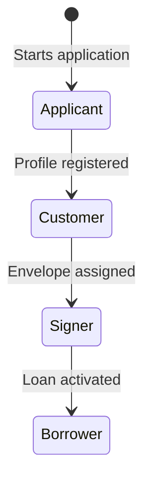

# Ubiquitous Language

**Product:** Loan Onboarding & Credit Decisioning Platform  
**Status:** Draft 0.1  
**Date:** 2026-08-06  
**Canonical language:** English  
**Scope:** Consumer-loan origination MVP, single applicant, fictitious demo data

## 1. Purpose

This document defines the canonical business vocabulary used by product documentation, domain models, APIs, events, tests, logs and conversations. A term has one precise meaning inside its bounded context. When the same real-world concept requires different meanings across contexts, the context qualifier is mandatory.

The source code and public contracts use the English canonical term. Spanish explanations are provided to support discovery, but translated synonyms must not appear in code.

## 2. Language rules

1. Use business terms, not provider or infrastructure terminology, in the domain model.
2. Commands use imperative verbs: `SubmitCreditApplication`.
3. Events state completed facts in past tense: `CreditApplicationSubmitted`.
4. State names use nouns or completed conditions: `DecisionPending`, `OfferAccepted`.
5. Public identifiers carry the entity name: `applicationId`, `offerId`, `loanAccountId`.
6. Monetary values always include amount and ISO 4217 currency.
7. Timestamps are UTC instants; business dates are explicit date-only values.
8. Declines and failures use stable reason codes, not free-text logic.
9. Provider payloads are translated through an anti-corruption layer.
10. Integration events contain references and minimum necessary snapshots, never raw OTPs, document bytes or unnecessary PII.

## 3. End-to-end product terms

| Canonical term | Spanish explanation | Precise meaning | Not interchangeable with |
| --- | --- | --- | --- |
| `Loan Origination` | Originación de crédito | End-to-end process from application start through activation of the loan account. | Onboarding, underwriting, disbursement |
| `Customer Onboarding` | Vinculación del cliente | Collection and validation of customer data, consents and identity for this application. | Full loan origination |
| `Application Process` | Proceso de solicitud | Bounded context that tracks the applicant journey and coordinates progression between contexts. | Credit Application aggregate, decision engine |
| `Credit Application` | Solicitud de crédito | Applicant's request to be evaluated for a specific credit product. | Credit offer, loan account |
| `Onboarding Process` | Proceso de vinculación/originación | Long-running process state associated with one credit application. | Individual service workflow |
| `Application Stage` | Etapa de la solicitud | Coarse-grained customer-visible position in the end-to-end journey. | Internal status of another context |
| `Terminal State` | Estado terminal | State from which the process cannot advance without an explicit reopen or recovery operation. | Temporary failure |
| `Correlation Timeline` | Línea de tiempo correlacionada | Sanitized chronological projection of facts belonging to one application flow. | Authoritative audit evidence |

## 4. Parties and roles

| Canonical term | Definition | Lifecycle rule |
| --- | --- | --- |
| `Applicant` | Natural person requesting the loan and interacting with the application process. | Exists from application start. |
| `Customer` | Party whose profile and identity are registered in Customer & Identity. | May exist before or independently of an application. |
| `Borrower` | Customer who becomes contractually obligated under an activated loan account. | The applicant is not a borrower until activation. |
| `Signer` | Person authorized to sign a specific signature envelope. | Bound to one envelope and signing purpose. |
| `Credit Analyst` | Internal actor who views cases and, in future iterations, handles exceptions or manual review. | Does not alter automated decisions in MVP v1. |
| `Administrator` | Internal actor who manages future products, rule sets or templates. | Configuration capability is outside the walking skeleton. |
| `Identity Provider` | External or simulated system that supplies identity-verification evidence or outcome. | Provider language never becomes canonical domain language. |
| `Disbursement Provider` | External or simulated system that executes a transfer. | Its reference is evidence, not the domain order identifier. |

### Role transition

These roles may refer to the same person but express different responsibilities and legal states.

## 5. Application Process vocabulary

| Term | Definition | Invariant / boundary |
| --- | --- | --- |
| `Application Number` | Human-friendly, non-sensitive reference displayed to the applicant. | Not used as the database or event aggregate ID. |
| `Application ID` | Globally unique technical/business identifier of a credit application. | Stable for the full process. |
| `Selected Product` | Credit product requested when the application is created. | Product definition is referenced, not owned by Application Process. |
| `Submission` | Explicit act that freezes required application inputs and requests evaluation. | Draft capture is not submission. |
| `Stage History` | Ordered record of valid coarse-grained stage changes. | Append-only; not a substitute for domain events. |
| `Process Policy` | Automated reaction that observes a fact and requests the next action. | Must not bypass invariants of the receiving aggregate. |
| `Reopen` | Explicit operation that permits a terminal application to begin a new valid attempt. | Never implied by message retry. |
| `Cancel` | Applicant or authorized operations request to stop an application before the allowed boundary. | Applicant cancellation is allowed only before signature in MVP. |
| `Complete Application` | Mark the onboarding journey successful after the loan account is activated. | Does not itself create or activate a loan. |

### Canonical application stages

| Stage | Meaning | Entry fact |
| --- | --- | --- |
| `Draft` | Data may still be captured or changed. | `CreditApplicationStarted` |
| `IdentityPending` | Submitted application is awaiting identity outcome. | `CreditApplicationSubmitted` |
| `IdentityRejected` | Identity requirements were not met; terminal for the current attempt. | `CustomerIdentityRejected` |
| `DecisionPending` | Verified application is being assessed. | `CustomerIdentityVerified` |
| `Offered` | One active offer is available for applicant action. | `CreditOfferCreated` |
| `CreditDeclined` | No offer was produced because the credit decision was unfavorable. | `CreditApplicationDeclined` |
| `OfferAccepted` | Applicant accepted the active offer and its terms hash. | `CreditOfferAccepted` |
| `OfferClosed` | Offer was rejected or expired without acceptance. | `CreditOfferRejected` or `CreditOfferExpired` |
| `DocumentsPending` | Contract package is being generated or reviewed. | Offer accepted |
| `SignaturePending` | Approved package is awaiting valid signatures. | `DocumentPackageApproved` |
| `BookingPending` | Signed package is awaiting loan reservation. | `DocumentPackageSigned` |
| `DisbursementPending` | Reserved loan is awaiting confirmed funds transfer. | `LoanAccountReserved` |
| `ActivationPending` | Transfer is confirmed and loan activation must complete. | `CreditDisbursed` |
| `DisbursementFailed` | Transfer reached a terminal failure and the loan cannot activate. | `CreditDisbursementFailed` |
| `Completed` | Loan account is active and origination succeeded. | `LoanAccountActivated` |
| `Cancelled` | Process was explicitly stopped within the allowed cancellation boundary. | `CreditApplicationCancelled` |

## 6. Customer & Identity vocabulary

| Term | Definition | Invariant / boundary |
| --- | --- | --- |
| `Customer Profile` | Authoritative customer data required for onboarding in the demo. | Application keeps only references and permitted snapshots. |
| `Personally Identifiable Information (PII)` | Data that identifies or can reasonably identify a person. | Minimized in events and redacted from logs. |
| `Consent` | Customer's explicit authorization for one defined purpose under one text/version. | Consent is not inferred from application submission. |
| `Consent Record` | Immutable evidence of who consented, to what purpose/version and when. | Revocation creates a new fact; it does not erase history. |
| `Required Consent Set` | Product/process-specific collection of consents required before submission. | All required consents must be valid at submission. |
| `Identity Verification` | Controlled process that evaluates whether the claimed identity meets a required level. | Distinct from authentication and creditworthiness. |
| `Verification Case` | One attempt to verify a customer's identity. | A retry creates or versions an attempt according to policy. |
| `Verification Level` | Provider-neutral strength/category of completed verification. | Never expose provider-specific codes outside the ACL. |
| `Identity Verified` | Successful verification outcome valid until a specified instant when applicable. | Does not imply credit eligibility. |
| `Identity Rejected` | Verification outcome that does not satisfy identity requirements, with safe reason codes. | Does not mean credit declined. |
| `Identity Evidence Reference` | Protected pointer to evidence owned by this context/provider. | Raw evidence is not published in events. |

## 7. Credit Decisioning vocabulary

| Term | Definition | Invariant / boundary |
| --- | --- | --- |
| `Credit Assessment` | Versioned evaluation of a verified application using one immutable input snapshot. | Reevaluation creates a new assessment version. |
| `Assessment Input Snapshot` | Exact declared data, derived values and external signals used by an assessment. | Immutable and traceable to its sources. |
| `Declared Income` | Income reported by the applicant for assessment. | Not treated as verified income unless explicitly qualified. |
| `Declared Obligations` | Recurring financial obligations reported or simulated for the applicant. | Used only according to the active rule set. |
| `Payment Capacity` | Maximum periodic payment supportable under the affordability rules. | Not the same as maximum loan amount. |
| `Affordability Assessment` | Calculation that determines whether proposed payments fit the applicant's capacity. | Separate dimension from risk. |
| `Risk Score` | Normalized numeric signal used by deterministic risk rules. | Score alone is not a decision. |
| `Risk Band` | Explainable category such as `Low`, `Medium` or `High` derived from rules. | Do not call it customer segment. |
| `Customer Segment` | Commercial classification such as `New`, `Standard` or `Preferred`. | Does not represent default risk by itself. |
| `Eligibility` | Satisfaction of mandatory product and policy conditions. | Eligible does not mean the loan is granted. |
| `Rule Set` | Named, immutable and versioned collection of decision rules. | Every published decision references exactly one version. |
| `Credit Decision` | Immutable outcome of one assessment: `Favorable` or `Unfavorable` for MVP. | It is not an accepted offer or an active loan. |
| `Favorable Decision` | Outcome permitting creation of an offer under the evaluated rules. | Canonical replacement for ambiguous “application approved.” |
| `Unfavorable Decision` | Outcome that produces no offer and contains one or more decline reason codes. | Use business-safe reasons for applicant views. |
| `Reason Code` | Stable machine-readable explanation for a decision or failure. | Display text is localized separately. |
| `Credit Offer` | Time-limited proposal of immutable credit terms produced from a favorable decision. | Not a loan account and not contractual acceptance. |
| `Maximum Eligible Amount` | Highest principal supported by affordability, risk and product rules at assessment time. | Applicant may receive or select a lower offered amount. |
| `Offer Terms` | Principal, currency, interest rate, rate convention, term, payment frequency and expiry. | Terms become immutable when published. |
| `Offer Expiry` | Instant after which an offer cannot be accepted. | Message delay does not extend expiry. |
| `Terms Hash` | Deterministic digest of the exact offer terms accepted by the applicant. | Used for traceability, not as a signature. |
| `Supersede Offer` | Replace an unaccepted offer with a newer offer generated by an explicit reassessment/policy. | At most one active offer per application. |

### Decision outcomes

| Outcome | Result | Forbidden interpretation |
| --- | --- | --- |
| `Favorable` | Create a credit offer. | Funds or final credit already approved/granted. |
| `Unfavorable` | Decline the application with reason codes. | Identity rejection or technical processing failure. |
| `ManualReviewRequired` | Future paused outcome for analyst review. | Included in MVP walking skeleton. |

## 8. Document Preparation vocabulary

| Term | Definition | Invariant / boundary |
| --- | --- | --- |
| `Document Template` | Versioned source used to generate a document type. | Published template versions are immutable. |
| `Document Artifact` | Generated file plus metadata and content hash. | File bytes live in protected object storage. |
| `Document Package` | Versioned set of artifacts generated from one accepted offer snapshot. | Package contents cannot change after applicant approval. |
| `Package Version` | Monotonic version identifying a regenerated package. | Correction produces a new version. |
| `Document Review` | Applicant's opportunity to inspect the package before signing. | Review does not constitute signature. |
| `Document Approval` | Applicant confirmation that the displayed package is ready to be signed. | Not underwriting or internal credit approval. |
| `Document Correction` | Applicant request indicating that package data or contents require regeneration. | Invalidates any envelope based on that package version. |
| `Package Hash` | Digest binding the exact package metadata and document hashes. | Signature evidence must reference the approved hash. |

## 9. Electronic Signature vocabulary

| Term | Definition | Invariant / boundary |
| --- | --- | --- |
| `Signature Envelope` | Signing transaction that binds a package version, signer, purpose and lifecycle. | One envelope cannot silently switch package versions. |
| `Electronic Signature` | Recorded act by which an authorized signer consents to the exact document package. | OTP validation alone is not a signature. |
| `Signing Authorization` | Short-lived authorization produced after a valid OTP outcome for a specific signer/envelope. | Single-purpose and single-use. |
| `Signature Evidence` | Tamper-evident metadata proving what was signed, by whom, when and under which authorization/provider reference. | Stored separately from delivery logs. |
| `Signed Package` | Approved package for which all required signatures and evidence are complete. | Only this fact can authorize loan reservation. |
| `Signature Expiry` | Terminal condition when the envelope can no longer be signed. | Requires a new controlled signing flow. |

## 10. Communications and OTP vocabulary

| Term | Definition | Invariant / boundary |
| --- | --- | --- |
| `Communication` | Message intended for a recipient through a configured channel. | Generic term; do not use as synonym for notification delivery. |
| `Notification Request` | Intent to send a transactional message using a template and recipient reference. | Does not guarantee delivery. |
| `Notification Delivery` | Aggregate that tracks attempts and terminal delivery outcome for one request/channel. | Delivery success does not prove the recipient read it. |
| `Delivery Channel` | Mechanism such as SMS or email. | Channel-specific details remain behind an adapter. |
| `Message Template` | Versioned content definition populated with approved variables. | Never interpolate secrets into logs. |
| `OTP` | One-time secret entered by a signer to prove control of a delivery destination. | Never persisted or emitted in plaintext. |
| `OTP Challenge` | Time-bound, attempt-limited, single-use challenge bound to signer, purpose and envelope. | Communications owns its lifecycle and validation. |
| `OTP Issue` | Creation of a challenge and its secret/hash pair. | Issued does not mean delivered. |
| `OTP Delivery` | Attempt to transmit the secret through the selected channel. | Delivered does not mean validated. |
| `OTP Validation` | Comparison of a submitted value against an active challenge under security policy. | Validated authorizes a purpose; it does not sign documents. |
| `OTP Reissue` | Creation of a new controlled challenge after expiry/failure according to policy. | Invalidates or leaves unusable the prior challenge. |
| `Masked Destination` | Safe representation of the recipient destination for display. | Raw destination should not appear in public events. |

## 11. Loan Booking vocabulary

| Term | Definition | Invariant / boundary |
| --- | --- | --- |
| `Loan Booking` | Recording and lifecycle management of the contractual credit obligation. | Separate from funds transfer. |
| `Loan Account` | Aggregate representing the contractual loan and its initial repayment schedule. | At most one active loan per application. |
| `Loan Reservation` | Loan account in `PendingDisbursement`, created before releasing funds. | Does not accrue interest and is not an active receivable. |
| `PendingDisbursement` | Reserved loan state awaiting confirmed transfer. | Cannot be shown as an active credit. |
| `Loan Activation` | Transition that makes the booked obligation effective after matching disbursement confirmation. | Idempotent and only after confirmed funds. |
| `Active Loan` | Loan account whose obligation is effective and whose schedule is available. | Applicant becomes borrower at this point. |
| `Contractual Terms` | Accepted terms carried into the loan account and documents. | Must match the accepted-offer snapshot. |
| `Repayment Schedule` | Versioned sequence of expected installments for the loan. | Initial schedule is generated before or at activation but becomes effective upon activation. |
| `Installment` | One scheduled payment with due date and amount breakdown. | Not an actual payment transaction. |
| `Account Number` | Human-usable or tokenized reference assigned to a loan account. | Not the internal `loanAccountId`. |

## 12. Disbursement vocabulary

| Term | Definition | Invariant / boundary |
| --- | --- | --- |
| `Disbursement` | Controlled release of approved loan funds to a validated destination. | Does not create the contractual loan account. |
| `Disbursement Order` | Aggregate authorizing one transfer for one loan reservation. | At most one successful disbursement per reservation. |
| `Disbursement Destination` | Tokenized/simulated account or wallet destination for funds. | Raw credentials are never stored. |
| `Disbursement Attempt` | One provider interaction made under the stable order idempotency key. | Retried attempts do not create new business orders. |
| `Disbursement Confirmation` | Provider-confirmed fact containing matching amount, currency and reference. | Required for activation. |
| `Transient Failure` | Failure for which retry may safely succeed. | Retried with the same idempotency key. |
| `Terminal Failure` | Failure that policy declares non-retryable for the current order. | Prevents activation and triggers reservation recovery. |
| `Unknown Outcome` | Provider response is ambiguous or unavailable after submission. | Must be reconciled before retrying or declaring failure. |
| `Provider Reference` | External provider identifier for reconciliation. | Not the domain order ID or idempotency key. |
| `Reconciliation` | Process that establishes the authoritative result of an ambiguous or inconsistent financial operation. | Precedes any explicit reversal decision. |
| `Financial Reversal` | Explicit future workflow to undo a confirmed transfer when legally and operationally valid. | Never an automatic compensation in MVP. |

## 13. Cross-cutting integration vocabulary

| Term | Definition | Rule |
| --- | --- | --- |
| `Domain Event` | Fact meaningful inside one bounded context. | May remain private. |
| `Integration Event` | Versioned, sanitized public fact published for other contexts. | Schema belongs in the contracts repository. |
| `Command` | Request to perform an action that may be accepted or rejected. | A command is not a fact. |
| `Policy` | Automated rule that reacts to a fact and issues a command. | Named after business intent. |
| `Event Envelope` | Standard transport metadata surrounding an integration-event payload. | Contains event, correlation, causation, aggregate and producer identifiers. |
| `Correlation ID` | Identifier connecting all messages in one end-to-end business flow. | Usually stable across the application journey. |
| `Causation ID` | Identifier of the message or action that directly caused the current message. | Changes at each causal step. |
| `Idempotency Key` | Stable client/business key that makes repeated execution equivalent to one execution. | Mandatory for sensitive and retryable operations. |
| `Inbox` | Consumer record preventing duplicate processing of a message. | Owned by each consumer. |
| `Outbox` | Producer record atomically persisted with a business change for later publication. | Prevents state/event inconsistency. |
| `Retry` | Re-execution of the same intended operation after a retryable failure. | Reuses identity/idempotency semantics. |
| `Dead-Letter Queue (DLQ)` | Isolation queue for messages that exhausted delivery policy. | Operational mechanism, not a business state. |
| `Compensation` | Explicit business action that semantically offsets a completed action. | Not database rollback across services. |
| `Projection` | Read-optimized view derived from events or owned data. | Not authoritative write state. |
| `Audit Trail` | Append-only, access-controlled record of relevant business and security facts. | Must not synchronously control the workflow. |
| `Reason Code` | Stable, non-sensitive code explaining a business or operational outcome. | Separate from localized display text. |

## 14. Canonical reason codes v0

### Identity

- `REQUIRED_CONSENT_MISSING`
- `IDENTITY_NOT_VERIFIED`
- `IDENTITY_EVI