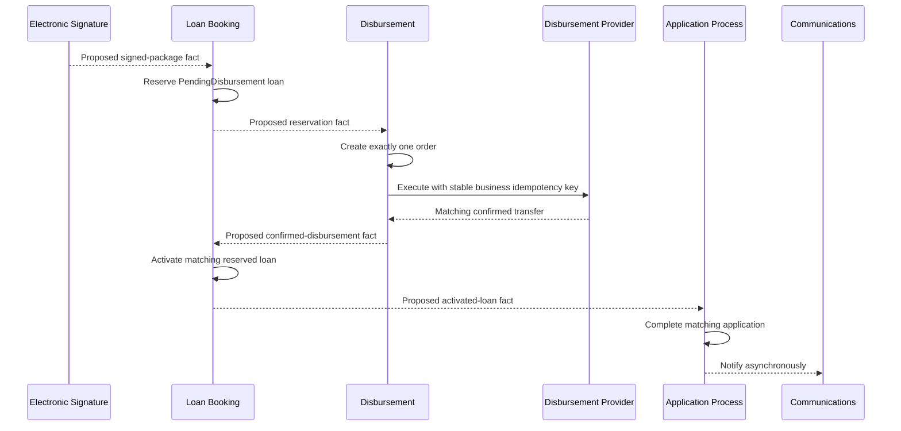

# Disbursement Workflow

## 1. Purpose and authority

This workflow defines the logical, financially safe sequence from a valid Signed Package through loan reservation, one Disbursement Order, provider execution/reconciliation, activation, and application completion. It is the canonical resolution source for `Q-009` manual recovery. The [business rules](../domain/BUSINESS_RULES.md), [events](../domain/DOMAIN_EVENTS.md), [Event Storming model](../domain/EVENT_STORMING.md), and [Security Model](../architecture/SECURITY_MODEL.md) retain authority for their subjects.

## 2. Scope and non-goals

It covers ordering, failures, ambiguity, idempotency, DLQ handling, and permitted manual recovery. The end-to-end journey uses the persisted Application Process process manager only for coarse cross-context progression. Each capability owns its internal workflow, policies, decisions, and recovery, as established by [ADR-003](../adr/ADR-003-EVENT-DRIVEN.md). It does not define provider protocols, persistence schema/scheduler technology/IAM, numeric retry budgets or timers, reservation cancellation/release, automatic reversal, post-failure business disposition, or new events.

## 3. Trigger

Loan Booking observes the proposed minimized `IE-ES-001 DocumentPackageSigned.v1` for the exact valid package, signer, evidence reference, application, and accepted terms.

## 4. Preconditions

- Signed Package evidence is valid, authorized, and bound to the accepted terms/package version.
- No active loan or conflicting reservation exists for the application.
- Amount, currency, accepted terms, application/offer references, and tokenized destination can be validated by their owners.
- Correlation, event, reservation, order, and business idempotency identities are stable.

## 5. Participants and ownership

| Participant | Owns | Prohibited authority |
| --- | --- | --- |
| Loan Booking | Reservation (`PendingDisbursement`), contractual terms, schedule, activation | Transfer execution/provider outcome |
| Disbursement | Order, destination snapshot/token, attempts, stable provider key, reconciliation, success/failure | Reservation/activation or application completion |
| Application Process | Coarse state and completion after activation | Booking/transfer decisions |
| Platform Operator | May request owner-controlled recovery with evidence | Direct queue/message/database edits or fabricated success |
| Provider | External transfer result behind DS adapter | Platform business state |
| Audit / Communications | Sanitized asynchronous projection/notification | Blocking or authorizing completion |

## 6. Happy path

| Step | Trigger / actor | Command | Owner / aggregate | Completed fact | Public mapping | Consumer / reaction | Idempotency | Outcome | Status | Sources |
| --- | --- | --- | --- | --- | --- | --- | --- | --- | --- | --- |
| 1 | Signed-package reaction | `CMD-LB-001 ReserveLoanAccount` | LB / `LoanAccount` | `DE-LB-001 LoanAccountReserved` | `IE-LB-001 LoanAccountReserved.v1` | DS creates one order | Application/signed-package reservation identity | `PendingDisbursement` reservation | Proposed | [Phase E](../domain/EVENT_STORMING.md#8-phase-e--loan-booking-and-disbursement) |
| 2 | Reservation reaction | `CMD-DS-001 CreateDisbursementOrder` | DS / `DisbursementOrder` | `DE-DS-001 DisbursementOrderCreated` | — | Validate amount/currency/reservation/token | One order per reservation | Disbursement Order | Confirmed | [BR-DS-001](../domain/BUSINESS_RULES.md#11-disbursement-ds) |
| 3 | Valid order | `CMD-DS-002 ExecuteDisbursement` | DS / `DisbursementOrder` | `DE-DS-002 DisbursementRequested` | — | Provider executes | Same order + stable provider key | `DisbursementPending` | Confirmed | [BR-DS-002](../domain/BUSINESS_RULES.md#11-disbursement-ds) |
| 4 | Matching provider confirmation | `CMD-DS-003 ConfirmDisbursement` | DS / `DisbursementOrder` | `DE-DS-003 CreditDisbursed` | `IE-DS-001 CreditDisbursed.v1` | LB validates matching reservation/amount/currency | Duplicate success returns same terminal fact | Confirmed Disbursement | Proposed | [DS events](../domain/DOMAIN_EVENTS.md#48-disbursement-ds) |
| 5 | Confirmed-funds reaction | `CMD-LB-002 ActivateLoanAccount` | LB / `LoanAccount` | `DE-LB-002 LoanAccountActivated` | `IE-LB-002 LoanAccountActivated.v1` | AP completes; Customer becomes Borrower | Activation tied to reservation/confirmation | Active Loan | Proposed | [BR-LB-004](../domain/BUSINESS_RULES.md#10-loan-booking-lb) |
| 6 | Activated-loan reaction | `CMD-AP-004 CompleteCreditApplication` | AP / `CreditApplication` | `DE-AP-005 CreditApplicationCompleted` | `IE-AP-004 CreditApplicationCompleted.v1` | CO/Audit react asynchronously | Matching application/account completion | `CreditApplicationCompleted` | Proposed | [Phase E](../domain/EVENT_STORMING.md#8-phase-e--loan-booking-and-disbursement) |

## 7. Alternate paths

| Condition | Detection owner | Permitted reaction | Forbidden shortcut | Retry / idempotency | Resulting state | Manual action | Status | Sources |
| --- | --- | --- | --- | --- | --- | --- | --- | --- |
| Invalid reservation/terms/destination | LB / DS | Reject order creation or stop execution; expose safe operational reason | Create transfer from unchecked input | Duplicate invalid request has no effect | No order or blocked pending case | Correct authoritative input through owner | Confirmed | [BR-DS-004](../domain/BUSINESS_RULES.md#11-disbursement-ds) |
| Duplicate reservation fact | DS | Return existing order/no-op | Create second order | Inbox + reservation uniqueness | Existing order state | None | Confirmed | [BR-DS-001](../domain/BUSINESS_RULES.md#11-disbursement-ds) |
| Duplicate execute request | DS | Return/reconcile existing attempt/result | Submit with another key | Same order/business key | Existing `DisbursementPending`/terminal state | None | Confirmed | [BR-DS-002](../domain/BUSINESS_RULES.md#11-disbursement-ds) |
| Transient retryable failure | DS | Record retryable `DE-DS-004`; bounded retry same order/key if outcome known absent | New order/key or activation | Preserve attempt/order identity | `DisbursementPending` | Operator visibility after exhaustion | Confirmed | [POL-DS-002](../domain/EVENT_STORMING.md#9-alternate-and-recovery-paths) |
| Unknown/ambiguous provider outcome | DS | Record derived `DE-DS-005`; `CMD-DS-004 ReconcileDisbursementOutcome` against original reference/key | Retry, fail, cancel, activate, or replace before known | Query, do not resubmit | `DisbursementPending` | Approved Q-009 recovery request may initiate reconciliation | Derived | [BR-DS-003](../domain/BUSINESS_RULES.md#11-disbursement-ds) |
| Inconsistent provider response | DS | Stop and reconcile provider-neutral authoritative outcome | Select convenient response or manufacture fact | Same order/reference | `OperationalException` / `DisbursementPending` | Audited DS-owned reconciliation | Derived | [Security Model](../architecture/SECURITY_MODEL.md#4-trust-boundaries-and-threat-surface) |
| Terminal/non-retryable or retry-exhausted failure | DS | Record `DE-DS-004`; stop automated progression and isolate | Activate, decline, cancel/release reservation, reverse automatically | Duplicate terminal fact harmless | `DisbursementFailed` | Q-009 request; no safe transfer retry unless absence/retry conditions pass | Proposed | [IE-DS-002](../domain/DOMAIN_EVENTS.md#58-disbursement-ds) |
| Confirmed funds then activation fails | LB | Critical reconciliation and idempotent activation retry | Automatic reversal, decline, cancellation, completion | Preserve exact confirmation/account identity | Critical `ActivationPending` | LB-owned recovery requested through `CMD-XS-002` | Proposed | [BR-LB-005](../domain/BUSINESS_RULES.md#10-loan-booking-lb) |
| Duplicate success / out-of-order fact | DS / LB / AP | Ignore duplicate; buffer/reject fact that would regress invariants | Repeat transfer/activation or regress state | Inbox + aggregate version | Business state unchanged | Investigate persistent ordering issue | Confirmed | [BR-XS-004](../domain/BUSINESS_RULES.md#12-cross-cutting-xs) |
| Consumer retry exhausted / DLQ | Owning consumer / operations | `CMD-XS-001 RedriveDeadLetter` after correction and compatibility review | Edit fact or blind replay | Original event ID and Inbox evidence | Redrive pending or isolated | Authorized audited redrive | Confirmed | [Recovery paths](../domain/EVENT_STORMING.md#9-alternate-and-recovery-paths) |

## 8. Timeouts and expiry

Provider timeout before a known result remains operational; after submission, ambiguity requires reconciliation. Reservation validity/release after failure is not selected here. Exact retry counts, backoff, provider timeouts, and recovery windows remain specifications/ADRs. `Q-007` keeps the exact first-installment date/rounding open.

## 9. Retry and idempotency

All retries are bounded. One reservation precedes one intended order; every attempt preserves the same order and business idempotency key. A confirmed absence of transfer is required before a recoverable execution retry. Unknown outcome is queried, never resubmitted. Inbox/Outbox and stable event IDs prevent duplicate business effects. DLQ redrive preserves the original fact.

## 10. Compensation and manual recovery (`Q-009` resolution)

Manual recovery begins only with existing `CMD-XS-002 RequestManualRecovery`. The request identifies the authorized actor, owning context, application, loan-account, order and correlation references, diagnosed condition, evidence, requested operation, idempotency identity, audit reason, and timestamp. It is unique, traceable, authorized, and context-owned.

Disbursement owns transfer recovery; Loan Booking owns reservation and activation. Platform Operator invokes owner-controlled capabilities only. Direct database, queue, or message editing; distributed rollback; fabricated success; silent reservation cancellation/release; and automatic funds reversal are prohibited.

| Diagnosed result | Permitted owner-controlled action | Preconditions | Forbidden action | Result |
| --- | --- | --- | --- | --- |
| Unknown/ambiguous | DS executes `CMD-DS-004 ReconcileDisbursementOutcome` using original order/provider reference/key | Authorized request and evidence | Retry/fail/cancel/activate/replace before authoritative result | Remain `DisbursementPending` until known |
| Confirmed transfer | DS executes `CMD-DS-003 ConfirmDisbursement` and records `DE-DS-003 CreditDisbursed`; LB consumes that fact and executes `CMD-LB-002 ActivateLoanAccount` | Matching amount, currency, reservation, and authoritative provider result | Manually manufacture success or mutate LB data | Normal activation path |
| Confirmed no transfer + recoverable failure | Reinvoke existing execution path with same order/key | Reservation valid; failure retryable; approved retry budget available | New order/key | `DisbursementPending` retry |
| Terminal or persistently ambiguous | Stop progression; isolate and expose to operations | No safe recovery remains | Activate, decline, silently release reservation, reverse funds, or complete application | `DisbursementFailed` or pending isolated case awaiting later governed decision |
| Confirmed funds + activation failure | LB retries/reconciles activation through owner operation | Exact matching confirmation retained | Automatic reversal or AP completion | Critical `ActivationPending` |

This policy resolves which manual actions are permitted without deciding reservation cancellation/release or a later post-failure business disposition.

## 11. Outcomes

- Success: confirmed transfer, Active Loan, then `CreditApplicationCompleted`.
- Pending: `DisbursementPending`; unknown outcome stays pending.
- Failed: `DisbursementFailed` ends automated transfer attempts but is not a credit decline and does not authorize reservation mutation.
- Critical: `ActivationPending` after confirmed funds; no automatic reversal.
- Transport/DLQ conditions remain infrastructure state, not business outcomes.

## 12. Security and data minimization

Use tokenized destination references and safe provider references. Events/logs/traces/audit/DLQs exclude raw destination credentials, full PII, provider bodies/credentials, tokens, document/evidence bytes, and unrestricted errors. Authorization and audit cover execution, reconciliation, manual recovery, redrive, protected reads, and irreversible operations. Audit is asynchronous/non-authoritative. `Q-004` remains the contract allowlist gate; AWS Demo retention/teardown follows the Security Model.

## 13. Open questions

- `Q-004`: exact contract fields.
- `Q-007`: first-installment date and repayment-schedule rounding.
- `Q-008`: applicant-safe failure messaging.
- `HS-006`: no approved private event name for activation failure.
- Reservation cancellation/release and post-terminal-failure business disposition remain future governed decisions.

## 14. Traceability and navigation

- [Master Loan Onboarding](LOAN_ONBOARDING.md)
- [Document Signing](DOCUMENT_SIGNING.md)
- [Event Storming Phase E](../domain/EVENT_STORMING.md#8-phase-e--loan-booking-and-disbursement)
- [Disbursement events](../domain/DOMAIN_EVENTS.md#48-disbursement-ds)
- [Security Model recovery](../architecture/SECURITY_MODEL.md#9-observability-audit-and-recovery)
