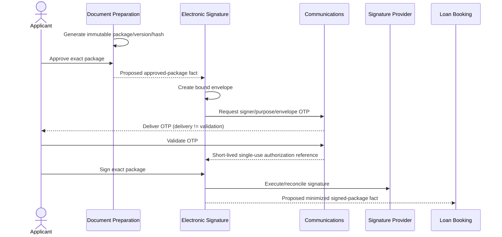

# Document Signing Workflow

## 1. Purpose and authority

This workflow defines the logical sequence from an accepted active offer through immutable package preparation, applicant review, OTP authorization, electronic signature, and the minimized signed-package fact. The [business rules](../domain/BUSINESS_RULES.md), [events](../domain/DOMAIN_EVENTS.md), [ownership catalog](../architecture/DATA_OWNERSHIP.md), and [Security Model](../architecture/SECURITY_MODEL.md) remain authoritative.

## 2. Scope and non-goals

It covers Document Preparation, Communications, and Electronic Signature ownership and their recovery paths. The end-to-end journey uses the persisted Application Process process manager only for coarse cross-context progression. Each capability owns its internal workflow, policies, decisions, and recovery, as established by [ADR-003](../adr/ADR-003-EVENT-DRIVEN.md). It does not choose providers, define legal signature classes, publish schemas, define field allowlists, or implement persistence schemas, scheduler technology, storage, or transport.

## 3. Trigger

Document Preparation observes the proposed minimized `IE-AP-002 CreditOfferAccepted.v1` for an active, unexpired offer and exact canonical `termsHash` recorded by Application Process.

## 4. Preconditions

- Application Process recorded one valid acceptance with exact `offerId` and `termsHash`.
- Credit Decisioning remains authoritative for immutable offer terms.
- Document templates and accepted-offer snapshot are identifiable and immutable.
- Applicant/signer authorization and protected-object access are owner-controlled.

## 5. Participants and ownership

| Participant | Owns | Does not own |
| --- | --- | --- |
| Application Process | Acceptance journey record and coarse stage | Offer terms, package contents, OTP, signature evidence |
| Document Preparation | Package contents, versions, artifacts/hashes, approval, correction/invalidation | Envelope, OTP, signature evidence |
| Communications | OTP issue, protected representation, attempts, expiry, block, validation, reissue, delivery state | Signature completion |
| Electronic Signature | Envelope, signer/purpose/package binding, authorization consumption, provider interaction, evidence, signed result | Package generation or OTP validation |
| Applicant / Signer | Reviews exact package, requests correction, supplies OTP, performs signature action | Authoritative state mutation outside owner commands |

Every Signature Envelope is bound to the exact package ID, monotonic package version, package hash, signer, signing purpose, and expiry. A valid Signing Authorization is short-lived, single-use, and bound to the same signer, purpose, and envelope; OTP validation authorizes signing but never signs the package.

## 6. Happy path

| Step | Trigger / actor | Command | Owner / aggregate | Completed fact | Public mapping | Consumer / reaction | Idempotency | Outcome | Status | Sources |
| --- | --- | --- | --- | --- | --- | --- | --- | --- | --- | --- |
| 1 | Accepted-offer reaction | `CMD-DP-001 GenerateDocumentPackage` | DP / `DocumentPackage` | `DE-DP-001 DocumentPackageGenerated` | `IE-DP-001 DocumentPackageGenerated.v1` | AP/Audit project refs/hashes | Offer + package/version identity | `DocumentsPending` | Proposed | [Phase C](../domain/EVENT_STORMING.md#6-phase-c--documents-and-approval) |
| 2 | Applicant after protected review | `CMD-DP-002 ApproveDocumentPackage` | DP / `DocumentPackage` | `DE-DP-002 DocumentPackageApproved` | `IE-DP-002 DocumentPackageApproved.v1` | ES creates exact envelope | Package version/hash + action key | Approved immutable package | Proposed | [BR-DP-002](../domain/BUSINESS_RULES.md#7-document-preparation-dp) |
| 3 | Approved-package reaction | `CMD-ES-001 CreateSignatureEnvelope` | ES / `SignatureEnvelope` | `DE-ES-001 SignatureEnvelopeCreated` | — | ES requests challenge | Package/signer/purpose uniqueness | `SignaturePending` | Confirmed | [Phase C](../domain/EVENT_STORMING.md#6-phase-c--documents-and-approval) |
| 4 | Signature flow | `CMD-CO-001 IssueOtpChallenge` | CO / `OtpChallenge` | `DE-CO-001 OtpChallengeIssued` | —; OTP facts private | Channel delivery | New challenge; prior reissue unusable | Challenge active | Confirmed | [Phase D](../domain/EVENT_STORMING.md#7-phase-d--otp-and-signature) |
| 5 | Channel success | `CMD-CO-002 RecordOtpDelivery` | CO / `NotificationDelivery` | `DE-CO-002 OtpDelivered` | — | Status view only | Delivery attempt identity | Delivered, not validated | Confirmed | [BR-CO-004](../domain/BUSINESS_RULES.md#9-communications-co) |
| 6 | Applicant | `CMD-CO-003 ValidateOtp` | CO / `OtpChallenge` | `DE-CO-004 OtpValidated` | — | ES receives authorization reference | Challenge single use/attempt bound | Signing authorized, not signed | Confirmed | [BR-CO-001](../domain/BUSINESS_RULES.md#9-communications-co) |
| 7 | Authorized signer | `CMD-ES-002 SignDocumentPackage` | ES / `SignatureEnvelope` | `DE-ES-002 DocumentPackageSigned` | `IE-ES-001 DocumentPackageSigned.v1` | LB may reserve matching loan | Envelope/provider operation identity | Signed Package | Proposed | [Phase D](../domain/EVENT_STORMING.md#7-phase-d--otp-and-signature) |

## 7. Alternate paths

| Condition | Detection owner | Permitted reaction | Forbidden shortcut | Retry / idempotency | Resulting state | Manual action | Status | Sources |
| --- | --- | --- | --- | --- | --- | --- | --- | --- |
| Applicant requests correction | DP | `CMD-DP-003 RequestDocumentCorrection`; record `DE-DP-003`; create monotonic replacement | Overwrite approved bytes/version | Preserve old versions/hashes | `DocumentsPending` | Review replacement | Confirmed | [BR-DP-003](../domain/BUSINESS_RULES.md#7-document-preparation-dp) |
| Package corrected/superseded | DP / ES | Invalidate obsolete package and bound envelope (`DE-ES-004` when recorded) | Reuse old envelope/challenge | Replacement has new package/envelope identities | `DocumentsPending` / `SignaturePending` | None beyond controlled path | Derived | [BR-ES-005](../domain/BUSINESS_RULES.md#8-electronic-signature-es) |
| OTP delivery fails | CO | Record `DE-CO-003`; bounded delivery retry or controlled reissue | Treat delivery as validation/signature | Attempt/challenge identities retained | `SignaturePending` | Inspect sanitized delivery status | Confirmed | [CO events](../domain/DOMAIN_EVENTS.md#46-communications-co) |
| OTP invalid / attempts exhausted | CO | Record `DE-CO-005`; increment/block; controlled reissue/manual review | Reset attempts or mark signed | Challenge single use; new identity on reissue | Retryable challenge or `SignatureBlocked` | Owner-authorized review | Confirmed | [Alternate paths](../domain/EVENT_STORMING.md#9-alternate-and-recovery-paths) |
| OTP expired | CO | Record `DE-CO-006`; `CMD-CO-004 ReissueOtpChallenge` if policy permits | Validate/reactivate expired challenge | Old challenge stays unusable | `SignaturePending` | Controlled reissue | Confirmed | [BR-CO-005](../domain/BUSINESS_RULES.md#9-communications-co) |
| Envelope expired | ES | Record derived `DE-ES-003`; create new controlled envelope/challenge | Reopen/sign expired envelope | New envelope/challenge IDs | `SignaturePending` | Owner recovery if repeated | Derived | [BR-ES-004](../domain/BUSINESS_RULES.md#8-electronic-signature-es) |
| Signature provider ambiguous | ES | Query/reconcile original provider operation | Retry irreversible signature or declare signed/failed by inference | Same envelope/provider reference | `SignaturePending` | Audited reconciliation | Derived | [Security Model](../architecture/SECURITY_MODEL.md#8-otp-and-electronic-signature-controls) |

## 8. Timeouts and expiry

Communications authoritatively enforces OTP expiry/attempts; Electronic Signature enforces envelope expiry. Expired envelopes require a new envelope and challenge. Package/offer invalidation makes bound material unusable. Numeric values come only from governed policy/specifications; workflows do not invent them.

## 9. Retry and idempotency

Package generation/approval, envelope creation, challenge issue/validation, and signing use stable business/action identities. Retries are bounded. Notification retry does not reset OTP state. Reissue creates a new challenge and invalidates the prior one. An ambiguous signature result is reconciled before another irreversible attempt. Inbox/Outbox handle duplicate public facts.

## 10. Compensation and recovery

Correction is an explicit DP-owned replacement, not rollback. Envelope invalidation is ES-owned. Operators invoke only owner-controlled correction, reissue, reconciliation, or recovery commands; they cannot edit objects/stores, reveal OTP, or manufacture signature evidence.

## 11. Outcomes

- Happy: exact `DocumentPackageSigned` / proposed minimized `DocumentPackageSigned.v1`.
- Waiting: `DocumentsPending`, `SignaturePending`.
- Blocked: `SignatureBlocked` or ambiguous provider result awaiting reconciliation.
- Cancellation remains AP-owned only while canonically authorized before the signing boundary.

## 12. Security and data minimization

Protected objects hold bytes; cross-context facts carry opaque references, package version/hash, safe signer/evidence references, and minimum metadata. Plaintext OTP is never persisted, logged, audited, emitted, traced, or placed in DLQ. Events exclude document/signature bytes, raw identity evidence, full PII, provider payloads/credentials, access tokens, and raw destination credentials. Notification destinations are masked. Protected-object reads, signing, reconciliation, and manual recovery are authorized and audited. `Q-004` remains open.

## 13. Open questions

- `Q-004`: exact contract field allowlists.
- `Q-008`: safe applicant-facing reason handling.
- Provider-specific signature timeout/callback controls remain implementation decisions; no production legal-signature class is selected.

## 14. Traceability and navigation

- [Master Loan Onboarding](LOAN_ONBOARDING.md)
- [Credit Decision](CREDIT_DECISION.md)
- [Disbursement](DISBURSEMENT.md)
- [Event Storming phases C-D](../domain/EVENT_STORMING.md#6-phase-c--documents-and-approval)
- [Security Model](../architecture/SECURITY_MODEL.md#8-otp-and-electronic-signature-controls)
