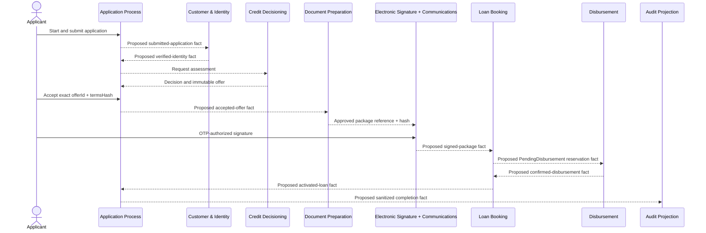

# Loan Onboarding Workflow

## 1. Purpose and authority

This document is the canonical master workflow for the Loan Onboarding Platform. It connects the five journey phases without replacing the [business rules](../domain/BUSINESS_RULES.md), [event catalog](../domain/DOMAIN_EVENTS.md), [Event Storming model](../domain/EVENT_STORMING.md), [data ownership](../architecture/DATA_OWNERSHIP.md), or [Security Model](../architecture/SECURITY_MODEL.md). Specialized detail belongs in [Credit Decision](CREDIT_DECISION.md), [Document Signing](DOCUMENT_SIGNING.md), and [Disbursement](DISBURSEMENT.md).

The workflow is logical and hosting-independent. [ADR-003](../adr/ADR-003-EVENT-DRIVEN.md) establishes a persisted Application Process process manager for coarse coordination; it does not publish contracts or imply that planned services are implemented.

## 2. Scope and non-goals

In scope: application start through activated loan and application completion, capability ownership, logical reactions, alternate outcomes, recovery, correlation, and idempotency. Out of scope: the process-manager persistence schema, scheduler technology, executable schemas and field allowlists beyond the approved [initial M1 catalog](../contracts/INITIAL_CONTRACT_CATALOG.md), provider configuration, infrastructure, numeric retry/timer defaults, and production policy.

The workflow is hosting-independent. `Local Zero AWS Cost` requires no AWS account or credentials and uses fictitious data, deterministic fakes, and owner-scoped adapters without bypassing boundaries. The ephemeral, Free-Tier-aware `AWS Demo` initially deploys only the approved walking skeleton and uses Cognito, EventBridge, consumer-specific SQS/DLQ, owner-scoped persistence, and optional protected S3 objects as defined by the [Container Architecture](../architecture/CONTAINER_DIAGRAM.md); it does not claim zero cost or production readiness. Both profiles preserve the same authorization, idempotency, retry, recovery, minimization, audit, retention, and verified-cleanup semantics.

Domain events remain private and are never published directly to EventBridge. Cross-context arrows refer only to versioned integration-event candidates cataloged in `DOMAIN_EVENTS.md`; `Proposed` candidates are neither schemas nor implementation claims.

## 3. Trigger

An authenticated Applicant requests `CMD-AP-001 StartCreditApplication` for the demonstration product. Application Process establishes the application ID, application number, product reference, correlation ID, and coarse journey record.

## 4. Preconditions

- The Applicant is authorized for the new or existing application; one active application per customer is enforced.
- Required product and policy versions are identifiable.
- Submission occurs only after complete required data and purpose-bound consent references exist.
- Local uses fictitious data and deterministic providers; AWS Demo uses only approved ephemeral capabilities.

## 5. Participants and ownership

| Participant | Workflow responsibility | Retained authority |
| --- | --- | --- |
| Applicant | Supplies data/evidence, chooses an offer, approves/signs documents | Own intent only; never supplies authoritative outcome fields |
| Application Process | Coarse saga, correlation, stage history, acceptance/rejection record, completion/authorized pre-signing cancellation | Does not decide identity, credit, documents, signature, booking, or transfer |
| Customer & Identity | Consent, profile, verification case/evidence and provider-neutral outcome | Identity result and evidence |
| Credit Decisioning | Immutable assessment, decision, alternatives, offer terms/expiry/supersession | Only `Favorable` or `Unfavorable` completed credit outcome |
| Document Preparation | Package contents, versions, hashes, approval/correction | Protected document artifacts |
| Communications | Notification delivery and OTP lifecycle/validation | OTP state and protected representation |
| Electronic Signature | Envelope, signer/package binding, provider interaction, evidence and signed fact | Signature completion |
| Loan Booking | Reservation, contractual terms, schedule, activation | Loan state; reservation is not activation |
| Disbursement | One order, attempts, provider reconciliation and transfer outcome | Money-movement result |
| Audit projection | Consumes sanitized facts asynchronously | Non-authoritative projection; never blocks progression |

## 6. Happy path

| Step | Trigger / actor | Command | Owner / aggregate | Completed fact | Public mapping | Consumer / reaction | Idempotency | Outcome | Status | Sources |
| --- | --- | --- | --- | --- | --- | --- | --- | --- | --- | --- |
| A1 | Applicant | `CMD-AP-001 StartCreditApplication` | AP / `CreditApplication` | `DE-AP-001 CreditApplicationStarted` | — | Applicant tracker | Start identity | `Draft` | Confirmed | [Phase A](../domain/EVENT_STORMING.md#4-phase-a--application-and-identity) |
| A2 | Applicant after profile/consent | `CMD-AP-002 SubmitCreditApplication` | AP / `CreditApplication` | `DE-AP-002 CreditApplicationSubmitted` | `IE-AP-001 CreditApplicationSubmitted.v1` | CI starts verification | Application/process uniqueness | `IdentityPending` | Proposed | [Phase A](../domain/EVENT_STORMING.md#4-phase-a--application-and-identity) |
| A3 | Provider-neutral success | `CMD-CI-004 RecordIdentityVerification` | CI / `IdentityVerification` | `DE-CI-004 CustomerIdentityVerified` | `IE-CI-001 CustomerIdentityVerified.v1` | AP requests assessment | Verification identity/event ID | `DecisionPending` | Proposed | [Phase A](../domain/EVENT_STORMING.md#4-phase-a--application-and-identity) |
| B | Verified identity | `CMD-CD-001 RequestCreditAssessment` through `CMD-AP-003 AcceptCreditOffer` | CD assessments/offers; AP acceptance | Decision, alternatives, offer, acceptance facts | Confirmed `IE-CD-*`; proposed `IE-AP-002` | DP generates exact accepted package | Snapshot/assessment/action identities | `DocumentsPending` | Proposed | [Credit Decision](CREDIT_DECISION.md) |
| C-D | Accepted offer / Applicant | Existing DP, CO, and ES commands | DP package; CO challenge; ES envelope | Approved and signed exact package | Proposed `IE-DP-*` and `IE-ES-001` | LB reserves loan | Package/envelope/challenge identities | `BookingPending` | Proposed | [Document Signing](DOCUMENT_SIGNING.md) |
| E1 | Signed-package reaction | `CMD-LB-001 ReserveLoanAccount` | LB / `LoanAccount` | `DE-LB-001 LoanAccountReserved` | `IE-LB-001 LoanAccountReserved.v1` | DS creates one order | Application/reservation uniqueness | `DisbursementPending` | Proposed | [Disbursement](DISBURSEMENT.md) |
| E2 | Reservation through provider confirmation | `CMD-DS-001` through `CMD-DS-003` | DS / `DisbursementOrder` | Order, request, `DE-DS-003 CreditDisbursed` | `IE-DS-001 CreditDisbursed.v1` | LB validates matching confirmation | Stable order/provider key | `ActivationPending` | Proposed | [Disbursement](DISBURSEMENT.md) |
| E3 | Matching confirmed funds | `CMD-LB-002 ActivateLoanAccount` | LB / `LoanAccount` | `DE-LB-002 LoanAccountActivated` | `IE-LB-002 LoanAccountActivated.v1` | AP completes; Customer becomes Borrower | Account/confirmation identity | Active Loan | Proposed | [Phase E](../domain/EVENT_STORMING.md#8-phase-e--loan-booking-and-disbursement) |
| E4 | Activated-loan reaction | `CMD-AP-004 CompleteCreditApplication` | AP / `CreditApplication` | `DE-AP-005 CreditApplicationCompleted` | `IE-AP-004 CreditApplicationCompleted.v1` | Communications and Audit react asynchronously | Completion identity | `CreditApplicationCompleted` | Proposed | [Phase E](../domain/EVENT_STORMING.md#8-phase-e--loan-booking-and-disbursement) |

The mandatory order is `Signed Package -> Loan Reservation (PendingDisbursement) -> Disbursement Order -> Confirmed Disbursement -> Loan Activation -> Application Completion`.

## 7. Alternate paths

| Condition | Detection owner | Permitted reaction | Forbidden shortcut | Retry / idempotency | Resulting state | Manual action | Status | Sources |
| --- | --- | --- | --- | --- | --- | --- | --- | --- |
| Missing submission data/consent | AP / CI | Remain Draft and collect missing input | Infer consent or start identity | Repeated submission is safe | `Draft` | None | Confirmed | [BR-AP-001](../domain/BUSINESS_RULES.md#4-application-process-ap) |
| Identity rejected | CI | Stop decisioning; retain traceable internal reasons; do not expose or translate them before `Q-008` | Convert to credit decline | Deduplicate fact; explicit new verification path | `IdentityRejected` | Authorized reopen only | Proposed | [IE-CI-002](../domain/DOMAIN_EVENTS.md#52-customer--identity-ci) |
| Unfavorable decision | CD | AP closes the credit path while retaining traceable internal reasons; applicant explanation remains blocked by `Q-008` | Treat provider/transport failure as decline | New governed assessment for reevaluation | `CreditDeclined` | No silent analyst override | Confirmed | [Credit Decision](CREDIT_DECISION.md) |
| Offer rejected/expired | AP / CD | Record explicit rejection or prevent expired acceptance | Mutate immutable offer or generate documents | Stable applicant action; clock fact idempotent | `OfferClosed` | Explicit reassessment/new-offer path | Proposed | [Alternate paths](../domain/EVENT_STORMING.md#9-alternate-and-recovery-paths) |
| Authorized cancellation before signing | AP | `CreditApplicationCancelled` under `BR-AP-004` | Cancel after signing through same path | Unique cancellation operation | `CreditApplicationCancelled` | Later boundary needs separate governed workflow | Confirmed | [DE-AP-006](../domain/DOMAIN_EVENTS.md#41-application-process-ap) |
| Document/signature problem | DP / CO / ES | Correction, reissue, or new envelope through owner | Overwrite package, reset challenge, manufacture signature | Preserve package/envelope/challenge identities | `DocumentsPending`, `SignaturePending`, or `SignatureBlocked` | Owner-controlled recovery | Derived | [Document Signing](DOCUMENT_SIGNING.md) |
| Transfer/activation problem | DS / LB | Retry, reconcile, isolate, or owner-controlled manual recovery | Decline, activate, cancel reservation, or reverse funds silently | Stable order/key; idempotent activation | `DisbursementPending`, `DisbursementFailed`, or `ActivationPending` | `CMD-XS-002 RequestManualRecovery` | Proposed | [Disbursement](DISBURSEMENT.md) |

## 8. Timeouts and expiry

Identity validity across reassessment remains `Q-006`. Offer expiry is owned by Credit Decisioning and prevents acceptance. Package correction invalidates obsolete signing material. Communications owns OTP expiry; Electronic Signature owns envelope expiry. Provider timeouts remain operational. Application Process persists workflow deadlines and timer metadata and receives idempotent due checks through a replaceable scheduling port; exact scheduler technology, schemas, and numeric timers remain deferred to service/IaC specifications under [ADR-003](../adr/ADR-003-EVENT-DRIVEN.md).

## 9. Retry and idempotency

All retries are bounded and preserve the same intended business identity. Stable command/action keys, event IDs, Outbox, and per-consumer Inbox support at-least-once delivery. Duplicate facts are ignored; out-of-order facts cannot regress owner state. Ambiguous irreversible provider operations are reconciled before retry. DLQ redrive occurs only after cause correction and compatibility review; queued business facts are never edited.

## 10. Compensation and recovery

Compensation is an explicit context-owned business command under `POL-XS-005 CompensateExplicitly`, never distributed rollback. Platform Operators use owner-controlled capabilities and cannot edit stores/queues, manufacture success, or change credit outcomes. Post-signing cancellation, reservation release/cancellation, and any financial reversal require separately governed decisions.

## 11. Outcomes

| Class | Outcomes |
| --- | --- |
| Terminal business | `CreditApplicationCompleted`, completed `Unfavorable` / `CreditDeclined`, `IdentityRejected`, explicit `OfferClosed`, offer expiry requiring a governed path, authorized pre-signing `CreditApplicationCancelled` |
| Operational pending | `IdentityPending`, `DecisionPending`, `DocumentsPending`, `SignaturePending`, `BookingPending`, `DisbursementPending` |
| Operational exception/blocked | `OperationalException`, `SignatureBlocked`, `DisbursementFailed`, critical `ActivationPending` |
| Infrastructure | Retry scheduled, duplicate/out-of-order delivery, DLQ/redrive pending, provider timeout/ambiguity; none is a credit decision |

## 12. Security and data minimization

Apply the [Security Model](../architecture/SECURITY_MODEL.md): authorize every action at the owner boundary; use opaque IDs, protected-object references, hashes, tokenized destinations, masked notifications, and minimum immutable snapshots. Events/logs/traces/audit/DLQs prohibit plaintext OTP, credentials/tokens, raw evidence or destination credentials, document bytes, full PII, provider bodies, internal rule traces, and unrestricted fraud data. Audit is sanitized, asynchronous, and non-authoritative. The [initial catalog](../contracts/INITIAL_CONTRACT_CATALOG.md) resolves `Q-004` only for its listed M1 fields; additions require a new review. AWS Demo retention and teardown are linked, not repeated here.

## 13. Open questions

- `Q-006`: identity validity and renewal across reassessment.
- `Q-007`: exact first-installment date and schedule rounding.
- `Q-008`: applicant-facing reason-code exposure/translation.
- `HS-006`: private event names for identity-provider unavailability and activation failure remain unapproved.

See the [assumptions register](../discovery/ASSUMPTIONS.md#open-questions).

## 14. Traceability and navigation

- [Credit Decision](CREDIT_DECISION.md)
- [Document Signing](DOCUMENT_SIGNING.md)
- [Disbursement](DISBURSEMENT.md)
- [Canonical Event Storming](../domain/EVENT_STORMING.md)
- [Domain and Integration Events](../domain/DOMAIN_EVENTS.md)
- [Security Model](../architecture/SECURITY_MODEL.md)
